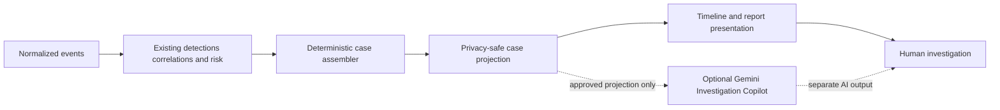
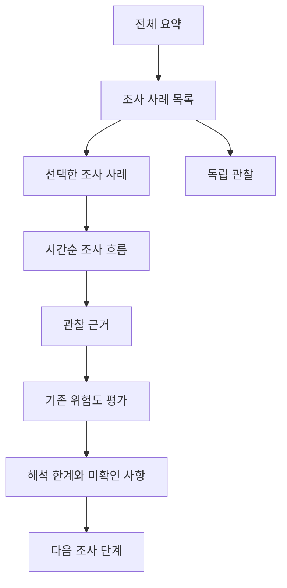

# Incident Case와 Investigation Timeline V1 설계

## 1. 목적

이 문서는 여러 로그에서 기존 결정적 분석이 만든 관찰을 사용자가 이해하고 다음 조사 행동을 선택할 수 있는 단위로 정리하는 V1 계약을 정의한다. 내부 타입명은 `IncidentCase`를 사용할 수 있지만, 사용자 화면의 기본 표시명은 **조사 사례**로 한다. `Incident`는 초보 사용자에게 이미 확정된 침해나 사고처럼 들릴 수 있고, `연관 관찰 묶음`은 정확하지만 일상적인 탐색 단위명으로 길다. `조사 사례`는 함께 검토할 이유가 있다는 뜻을 전달하면서 확정 사고라는 결론을 피한다.

현재 경계는 다음과 같다.

- `NormalizedEvent`는 UTC 정규화 시간, source, user, IP, raw log와 HTTP·인증·Linux Audit·프로세스 context를 가질 수 있는 내부 객체다.
- `DetectionResult`와 `Evidence`는 탐지 여부, 고정 유형, scalar 근거와 선택적 timestamp/time range를 보유한다.
- 분석 결과는 per-IP `results`와 전체 입력 범위 `global_correlation`을 분리한다.
- per-IP에는 `failed_to_successful_login`, `successful_login_to_file_access`, `brute_force_to_successful_login`, `password_spray_to_successful_login` 관계가 존재한다. 현재 HTML projection은 그중 앞의 로그인 전이와 Brute Force 전이만 공개한다.
- risk는 기존 `HIGH`/`MEDIUM`/`LOW`, likelihood, impact, confidence와 rationale을 분리한다.
- `ProcessExecutionContext`는 argv, `PROCTITLE`, CWD, PATH, PID/PPID, UID/GID, raw records 등 민감한 내부 값을 보유한다. 현재 공용 Linux Audit 경계는 승인된 count-only 요약만 허용한다.
- `InvestigationReportProjection`은 frozen dataclass와 tuple, 명시적 allowlist를 쓰며 raw event, full query, 원래 계정명과 raw `global_correlation`을 보유하지 않는다.
- CLI, API, HTML, LLM은 서로 다른 소비자 계약이다. Case/Timeline은 어느 하나의 문자열이나 schema를 재사용하는 우회 경로가 아니다.

V1 흐름은 다음과 같다.



Case assembler는 기존 분석 결과를 다시 탐지하거나 상관분석하지 않는다. 지원되는 기존 관계를 검증하고 조사 단위로 배치할 뿐이다. 이 결정은 프로젝트 설계 선택이며 NIST가 특정 grouping algorithm이나 임계값을 승인했다는 뜻이 아니다.

## 2. 비목표

V1은 다음이 아니다.

- 확정된 보안 사고, 공격 성공, 침해, 공격자·동일 인물·동일 캠페인의 판정
- 새 detector, correlation, threshold, risk, confidence 또는 numeric security score
- 자동 차단, 계정 비활성화, 격리, remediation 또는 자동 대응 단위
- raw log viewer, SIEM, EDR, 실시간 monitoring, persistent case database
- Path Traversal과 인증 활동의 시간 근접 결합
- Linux Audit process와 인증 활동의 추정 결합 또는 process tree 복원
- API/CLI/HTML/Gemini 계약 변경

## 3. 사용자 유형

### 3.1 초보 보안 학습자

| 항목 | 계약 |
|---|---|
| 주요 목표 | 어떤 관찰이 왜 함께 표시됐는지 이해하고, 사실과 분석 판단의 차이를 학습한다. |
| 자주 수행할 작업 | 첫 사례 찾기, 용어 설명 읽기, Timeline 순서 따라가기, 근거와 한계 비교, 다음 조사 단계 선택 |
| 어려운 용어 | Brute Force, Password Spraying-like, correlation, likelihood, impact, confidence, aggregate |
| 흔한 오해 | `HIGH`를 침해 확정으로 보거나, 로그인 성공·HTTP 200을 공격 성공으로 보거나, 가까운 시간을 인과관계로 해석함 |
| 필요한 정보 수준 | 한 문장 요약 뒤에 관찰 근거, 관계가 만들어진 고정 조건, 확인되지 않은 사실을 단계적으로 제공 |
| 처음 보여야 할 정보 | 가장 먼저 볼 조사 순서, 포함된 최고 위험도, 함께 묶인 이유, 시작·종료 시간, 관찰 수 |
| 접을 수 있는 상세 | 전체 evidence field 설명, 보조 rationale, UTC 보조 표기. 단, 핵심 한계와 다음 단계는 숨기지 않는다. |

### 3.2 주니어 보안 분석가

| 항목 | 계약 |
|---|---|
| 주요 목표 | 여러 관찰 중 우선 검토할 사례를 빠르게 찾고 외부 IdP·MFA·device·session 기록 조사로 이어간다. |
| 자주 수행할 작업 | 목록 정렬 확인, Timeline endpoint 검증, detection/correlation 근거 비교, 미확인 사항과 후속 확인 항목 기록 |
| 어려운 용어 | 대표 위험도와 subject risk의 차이, report-local alias, aggregate count, correlation scope |
| 흔한 오해 | 사례 번호를 영구 incident ID로 사용하거나, 최고 위험도를 사례 전체의 공격 성공도로 해석하거나, 별칭이 cross-report identity라고 가정함 |
| 필요한 정보 수준 | 고정 관계 유형, UTC/KST 시간, subject와 account alias, evidence reference, 기존 risk·confidence, 결합·분리 이유 |
| 처음 보여야 할 정보 | 검토 순서, 포함된 최고 위험도, supported correlation, 시간 범위, 주요 detection, 결합 이유 |
| 접을 수 있는 상세 | LOW·독립 관찰 세부, 반복적인 하위 근거. 원본 로그 위치나 민감 식별자는 보고서에 넣지 않는다. |

## 4. 핵심 사용자 작업

| 순서와 작업 | 시작 조건 | 성공 조건 | 필요한 정보 | 가능한 오류와 복구 | 접근성 요구사항 |
|---|---|---|---|---|---|
| 1. 분석 입력 선택 | 지원 형식과 개인정보 경고 확인 | 필요한 입력이 선택되고 선택 범위를 설명할 수 있음 | 지원 source, 필수·선택 입력, 크기·형식 경계 | 누락·지원 불가 입력은 어떤 입력이 실패했는지 bounded 안내; 지원 fixture나 올바른 형식으로 재선택 | label과 instruction을 text로 제공, 키보드 선택, 오류를 색상만으로 표시하지 않음 |
| 2. 분석 실행 | 입력 검증 완료 | 기존 pipeline이 한 번 실행되고 결과 또는 bounded 실패를 반환 | 진행 대상, 외부 전송·LLM 비사용 여부 | parse/read 실패 시 유효 결과를 과장하지 않고 수정·재실행 안내 | 자동 갱신·시간 제한 없음, status를 text로 제공 |
| 3. 첫 조사 사례 찾기 | case projection 성공 | 10초 이내 첫 검토 항목과 이유를 찾음 | 조사 순서, 포함된 최고 위험도, correlation, 시간 범위 | case 없음은 독립 관찰로 이동; 안전하다고 표현하지 않음 | heading/landmark, 표 caption, `th scope`, HIGH/MEDIUM/LOW text |
| 4. 구성 이유 확인 | 사례 선택 | 30초 이내 적용 rule과 관찰 관계를 자기 말로 설명 | rule 기반 고정 설명, subject, alias, time bound, 제외 조건 | 지원되지 않거나 모호한 관계는 자동 결합하지 않고 독립 관찰로 안내 | tooltip 없이 보이는 설명, 읽기 순서와 시각 순서 일치 |
| 5. Timeline 이해 | 사례 상세 진입 | 시작부터 종료까지 관찰과 도출 관계를 순서대로 구분 | KST와 UTC, entry kind, 사실·관계 label | timestamp 없음은 위치를 추정하지 않고 `시간 정보 없음` 영역으로 분리 | DOM 순서가 시간순, `<time>`과 text timezone, 200% 확대·좁은 화면 지원 |
| 6. 단계별 근거 확인 | Timeline entry 선택 또는 순차 읽기 | entry가 어떤 allowlisted evidence에 근거하는지 확인 | `근거 N`, typed scalar, detection/correlation display name | 상세가 projection에서 금지되면 원본 시스템에서 별도 확인하도록 안내 | native list/`dl`, 키보드 접근, focus visible |
| 7. 사실과 해석 구분 | 근거 확인 | 관찰 사실, 규칙 관계, risk assessment를 혼동하지 않음 | 별도 heading과 고정 category label | 임의 추정은 표시하지 않음; AI 출력은 별도 영역 | icon·색상만 쓰지 않고 category text 제공 |
| 8. 미확인 사항 확인 | assessment 확인 | 침해·공격 성공·credential reuse 등 미확인 항목을 찾음 | 유형별 fixed limitation | 정보 부재를 실패·안전으로 오해하면 명시적 bounded 문구로 교정 | 핵심 limitation은 접힘 안에만 두지 않음 |
| 9. 다음 조사 단계 선택 | 한계 이해 | 60초 이내 fixed allowlist에서 evidence review 행동을 선택 | IdP, MFA, device, session 등 읽기 전용 확인 목적 | 외부 기록이 없으면 `확인할 수 없음`을 유지; 자동 차단 명령 없음 | 순서 있는 list, 명확한 동사, keyboard·screen reader 접근 |
| 10. 저장·공유 | 검토 완료 | standalone sensitive report 정책에 맞게 보관·공유 | 분류, 0600, no-overwrite, retention 안내 | write 실패 시 부분 성공을 주장하지 않고 새 유효 경로 안내 | 오류와 성공을 text로 알리고 시간 제한 없음 |

## 5. 용어와 사용자 표시명

| 내부 기술 용어 | 권장 한국어 표시명 | 짧은 설명 | 피해야 할 오해 | tooltip 없이 이해 가능 |
|---|---|---|---|---|
| Incident Case | 조사 사례 | 명시적 기존 관계로 함께 검토하는 관찰 단위 | 확정 incident·침해·대응 ticket | 예. 첫 노출에 정의문 병기 |
| Subject | 분석 대상 IP | 현재 per-IP 분석의 주체 | 공격자 신원 | 예 |
| Detection | 탐지 관찰 | 기존 규칙 조건을 충족한 관찰 | 공격 성공 판정 | 예 |
| Correlation | 상관관계 관찰 | 기존 규칙이 계산한 시간적·논리적 관계 | 인과관계 | 예 |
| Evidence | 관찰 근거 | 규칙 결과를 재현하는 allowlisted 값 | raw log 전체 | 예 |
| Risk | 위험도 | 기존 subject risk 값 | 사례용 새 score | 예 |
| Likelihood | 가능성 평가 | 기존 규칙이 평가한 의심 활동 가능성 | 발생 확률·공격자 의도 | 정의문 필요 |
| Impact | 영향도 | 기존 context로 평가한 잠재 영향 수준 | 실제 피해 확인 | 정의문 필요 |
| Confidence | 판단 신뢰도 | 현재 evidence가 기존 판단을 지지하는 정도 | risk와 동일한 값 | 정의문 필요 |
| Aggregate | 관찰 수 집계 | 허용된 관찰 개수 요약 | 고유 process·incident 수 | 정의문 필요 |
| Observation | 관찰 | 로그 또는 기존 분석에서 확인된 항목 | 결론·원인 | 예 |
| Timeline | 시간순 조사 흐름 | 시간과 category가 명시된 관찰·관계 순서 | 완전한 공격 chain | 예 |
| Account alias | 계정 별칭 `Account N` | 한 보고서 안의 동일 계정 상관 참조 | 실제 이름·영구 ID | 예 |
| Process execution | 프로세스 실행 관찰 | Linux Audit에서 조립된 실행 telemetry의 집계 | malware·사용자 직접 실행 | 정의문 필요 |

핵심 설명을 hover tooltip이나 icon에만 넣지 않는다. 모바일, 키보드, screen reader 사용자도 동일한 text 설명을 읽을 수 있어야 한다.

## 6. Incident Case 정의

**조사 사례는 기존 분석에서 지원되는 시간적·주체적 관계를 바탕으로, 함께 검토할 가치가 있는 관찰을 하나의 조사 단위로 구성한 것이다.** 사례는 확정 사고, 공격 성공, 침해 확인, 공격자 식별, 동일 인물·캠페인 확인 또는 자동 대응 단위가 아니다.

V1 assembler는 완료된 existing analysis와 필요한 timestamp metadata를 읽기 전용 입력으로 받는 순수 함수로 설계한다. loader/parser/detector/correlation/risk를 다시 호출하지 않고 입력을 mutate하지 않는다. 내부 조립 결과는 외부 schema가 아니며 CLI, API, HTML, LLM에 직접 전달하지 않는다. 별도의 privacy-safe case projection만 외부 표시 후보가 된다.

## 7. V1 grouping policy

V1은 현재 per-IP 인증 관계 중 아래 세 가지 exact positive correlation만 사용한다. `successful_login_to_file_access`, `global_correlation`, Path Traversal, Linux Audit 관계는 V1 grouping에 사용하지 않는다. Case layer가 새 시간 임계값을 만들지 않고 기존 correlation이 이미 확정한 endpoint와 window를 검증한다.

| Rule ID | 입력과 전제조건 | 결합 조건과 분리 조건 | 최대 시간 범위 | 근거와 위험 | 사용자 설명 | 테스트 방법 |
|---|---|---|---|---|---|---|
| `CASE-AUTH-TRANSITION-01` | 같은 subject의 exact `failed_to_successful_login`; positive bool, exact account string, aware UTC failure/success timestamp, finite delta | 기존 관계의 동일 subject·동일 account·failure before success만 결합. IP/alias 일치만으로 추가 관찰을 붙이지 않음. malformed·ambiguous endpoint는 case 조립 실패 또는 독립 기존 결과로 유지 | endpoint 간 현재 기존 correlation window 60초. assembler가 새 window를 적용하지 않음 | 정상 사용자 재시도도 같은 패턴을 만들 수 있어 false merge 가능. 60초 밖의 관련 활동은 false split 가능 | `같은 분석 대상과 계정에서 60초 이내 인증 실패 후 로그인 성공이 기존 규칙으로 관찰되어 함께 검토합니다.` | exact/59/60/60초 초과, 역순, 다른 account/IP, input permutation, 정상 재시도 limitation |
| `CASE-BRUTE-SUCCESS-01` | positive `brute_force`와 exact `brute_force_to_successful_login`; same subject, correlation account가 strict-validated internal `features["target_users"]`에 존재, valid detection range와 relation endpoint | Brute Force aggregate와 직접 연결된 failure→success만 결합. target membership이 없거나 relation failure가 detection range 밖이면 분리·fail closed. 동일 endpoint의 generic auth relation은 supporting relation으로 흡수하고 Timeline fact는 중복하지 않음 | detection range는 현재 최대 60초, 마지막 failure→success는 최대 60초이므로 case start→end 상한은 120초 | shared/NAT source나 승인된 automation으로 false merge 가능. detector aggregate가 더 넓은 실제 활동을 잘라 false split 가능 | `Brute Force 탐지 범위와 그 뒤 같은 계정의 로그인 성공 관계가 직접 겹쳐 함께 검토합니다.` | target membership, detection range 경계, relation overlap, duplicate generic relation, endpoint mismatch, observation 단일 소속 |
| `CASE-SPRAY-SUCCESS-01` | positive `password_spraying_like`와 exact `password_spray_to_successful_login`; same subject, correlation account가 strict-validated internal `features["target_users"]`에 존재, valid range/endpoint | Password Spraying-like aggregate와 직접 연결된 account의 failure→success만 결합. account target membership을 검증할 수 없으면 자동 결합하지 않음. generic duplicate는 위와 같이 흡수 | detection range 최대 60초와 failure→success 최대 60초, 전체 상한 120초 | 여러 정상 계정의 동시 실패·automation이 false merge를 만들 수 있고, credential reuse를 증명하지 않음. target identity가 projection에 없으면 false split을 선택 | `여러 계정의 인증 실패 관찰과 그중 명시적으로 상관된 계정의 로그인 성공을 기존 관계에 따라 함께 검토합니다.` | target membership, alias consistency, 60/120초 경계, credential-reuse 금지 문구, permutation |

`features["target_users"]`는 현재 internal per-IP analysis에 존재하지만 원래 계정명을 포함한다. Phase 0은 exact list type, account strings와 detection range에 대한 strict contract를 먼저 정의해야 하며, 이 목록이나 임시 membership map을 public case projection, repr, error, log 또는 LLM에 복사해서는 안 된다. `CASE-SPRAY-SUCCESS-01`은 현재 internal correlation에는 존재하지만 현재 HTML projection의 지원 correlation은 아니다. Exact target-membership telemetry가 privacy-safe하게 입증되지 않으면 specific rule은 **no-go**이며 V1 구현 목록에서 제거한다. 문서가 존재한다는 이유로 지원됐다고 표시하지 않는다.

## 8. Case separation policy

- 동일 IP 자체는 결합 근거가 아니다. 명시적 supported correlation이 없거나 기존 window 밖이면 긴 시간의 활동을 별도 독립 관찰로 유지한다.
- 같은 report-local account alias가 여러 IP에 나타나도 V1은 cross-IP case를 만들지 않는다. Alias는 표시 참조이며 identity proof가 아니다.
- 하나의 canonical observation은 최대 한 사례에만 속한다. 사례 observation cardinality 합과 독립 observation 수는 입력 supported observation 수와 정확히 같아야 한다.
- 특정 `brute_force_to_successful_login` 또는 `password_spray_to_successful_login`과 endpoint가 완전히 같은 generic `failed_to_successful_login`은 새 사례를 만들지 않고 같은 사례의 supporting correlation으로 보존한다. 관찰 fact는 한 번만 표시한다.
- 두 specific relationship이 같은 observation을 서로 다른 사례로 요구하는 등 모호성이 생기면 precedence로 보안 의미를 추측하지 않는다. Bounded case-construction error로 중단하고 기존 분석 결과는 그대로 유효하다고 안내한다.
- 지원되지 않는 relation과 raw `global_correlation`은 case에 넣지 않는다. 기존 분석에서 삭제하지 않고 `V1 사례 구성에서 지원되지 않아 기존 결과에서 별도 검토`라는 bounded 상태만 허용한다.
- detection 없는 valid `failed_to_successful_login`은 correlation-only 조사 사례가 될 수 있다.
- LOW subject라도 valid supported correlation이 있으면 사례에 포함한다. 관계 없는 LOW supported detection은 독립 관찰로 보존한다.
- Path Traversal은 V1에서 항상 독립 관찰이다. 인증 사례와 가까운 시각이라는 이유로 결합하지 않는다.
- Linux Audit aggregate는 count-only 별도 섹션이며 사례와 Timeline에 포함하지 않는다.
- 어떤 case에도 안전하게 연결할 수 없는 supported detection/observation은 **독립 관찰**에 남긴다. 독립은 안전·정상·공격 없음이라는 뜻이 아니다.
- 입력 event, dict, subject 순서가 달라도 case 구조, observation assignment, review order와 report-local numbering은 같아야 한다.

## 9. Case identity

사용자용 식별자는 deterministic review sort가 끝난 뒤 부여하는 `조사 사례 1`, `조사 사례 2`, …뿐이다. 내부 타입명은 `IncidentCase`일 수 있다.

번호에는 원래 계정명, 파일명, 절대 경로, IP 조각, timestamp, UUID, hash 또는 원본에서 파생한 prefix/suffix를 넣지 않는다. 번호는 한 보고서 안의 탐색 참조이며 persistent ID, cross-report identity, ticket 번호가 아니다. 입력 observation이 추가·삭제되면 다음 보고서에서 번호가 달라질 수 있다.

## 10. Timeline contract

향후 public `CaseTimelineEntryProjection`은 frozen dataclass와 tuple만 사용하고 다음 최소 scalar 계약을 갖는다.

| 필드 | 계약 |
|---|---|
| `timeline_order` | 사례 안 canonical sort 후의 1-based 정수 |
| `entry_kind` | fixed enum: `observed_fact`, `detection_observation`, `derived_relationship`, `time_unknown` |
| `start_time_utc` / `end_time_utc` | timezone-aware UTC datetime 또는 명시적 absent; range가 아니면 end absent |
| `display_time_kst` | renderer가 arbitrary 변환하지 않도록 projection이 만든 고정 형식 text |
| `display_name` | fixed allowlist의 한국어 label 또는 기존 security display name |
| `subject_ip` | 검증된 canonical IP; 현재 분석 subject라서 허용 |
| `account_alias` | 필요할 때만 report-local `Account N`; 원래 account는 금지 |
| `source_category` | fixed enum/display mapping: 인증, 웹 접근, 분석 규칙 등. source filename은 금지 |
| `observed_fact_id` | fixed allowlist ID. 화면 text도 ID별 고정 mapping이며 arbitrary log text 금지 |
| `detection_ref` / `correlation_ref` | supported fixed type ID 또는 absent; 내부 객체 reference 금지 |
| `evidence_reference` | 사례 안 `근거 1` 같은 report-local ordinal; 파일·event ID가 아님 |
| `limitation_ids` | fixed limitation ID tuple; stable order와 dedup 적용 |

Timeline은 raw log line, full query, original account, credential, token, cookie, authorization header, raw Linux Audit record, argv, `PROCTITLE`, CWD, private PATH detail, source filename/path, exception, traceback 또는 internal repr를 포함하지 않는다. Projected string은 text content 외 HTML context에 넣지 않는 기존 renderer 원칙을 유지한다.

표시 구조는 다음을 구분한다.

1. **관찰된 사실** — timestamp와 allowlisted scalar로 직접 확인된 값
2. **탐지 관찰** — 기존 detector condition을 충족한 aggregate 또는 event result
3. **도출된 관계** — existing correlation type과 endpoint; 인과관계가 아님
4. **위험도 평가** — Timeline 밖 assessment 영역의 기존 값
5. **확인되지 않은 사항** — fixed limitation
6. **다음 조사 단계** — fixed allowlist의 read-only 확인 행동

자유형 rationale, AI 문장 또는 추정은 Timeline fact가 될 수 없다. 한 endpoint가 overlap correlation에 사용돼도 fact entry는 한 번만 존재하고 relationship entry만 distinct supported type별로 표시한다.

## 11. 시간 표시 정책

- 내부 비교·정렬의 canonical time은 timezone-aware UTC다. naive datetime은 malformed contract다.
- 한국어 V1 화면의 primary time은 system timezone이 아니라 표준 라이브러리 `ZoneInfo("Asia/Seoul")`로 고정 변환한 `YYYY-MM-DD HH:MM:SS KST (UTC+09:00)`이다.
- 같은 위치에 보조 UTC text `YYYY-MM-DD HH:MM:SSZ`를 제공하고 HTML 구현 시 `<time datetime="UTC ISO-8601">`을 사용한다. 원본 timezone은 현재 `NormalizedEvent`가 보존하지 않으므로 표시하거나 추정하지 않는다.
- microsecond가 0이면 초 단위, 0이 아니면 6자리 microsecond를 둘 다 KST/UTC에 표시한다. 정밀도를 임의 반올림해 순서를 숨기지 않는다.
- range는 시작과 종료를 모두 표기한다. timezone label을 반복 또는 명확한 shared label로 제공한다.
- sort key는 `(start_time_utc, end_time_utc-or-start, entry_kind rank, fixed type ID, canonical numeric IP, account alias, evidence ordinal)`이다. Kind rank는 `observed_fact`, `detection_observation`, `derived_relationship`, `time_unknown` 순이다.
- timestamp가 없으면 위치를 추정하지 않는다. `시간 정보 없음 — 자동 시간 결합에서 제외됨`으로 사례 뒤의 별도 time-unknown list에 두거나 독립 관찰로 보존한다.
- 다른 지역 또는 DST 환경에서도 V1 bytes가 달라지지 않는다. 향후 timezone 선택 기능은 explicit projected metadata와 별도 테스트 없이는 추가하지 않는다.

## 12. 대표 위험도와 검토 순서

사례에는 새 severity를 계산하지 않는다. 표시명은 **포함된 최고 위험도**이며 사례에 포함된 subject의 기존 risk 중 가장 높은 `HIGH`, `MEDIUM`, `LOW`를 그대로 고른다. V1 per-IP 관계만 사용하므로 보통 하나의 subject risk지만, 이름은 future multi-subject 의미를 과장하지 않는다. Risk가 같아도 likelihood·impact·confidence를 합성하거나 평균내지 않는다. 각 원래 subject assessment는 상세에 남긴다.

`포함된 최고 위험도`는 낮은 risk observation을 가릴 수 있고, case 전체가 HIGH 결론이라는 오해를 만들 수 있다. 따라서 목록과 상세에 `기존 분석 대상 위험도 중 가장 높은 값이며 새 점수가 아닙니다`를 함께 표시한다. Supported correlation 존재와 기존 confidence는 별도 열이다.

Case review sort는 다음 순서다.

1. 포함된 최고 기존 risk: `HIGH`, `MEDIUM`, `LOW`
2. supported correlation 존재 사례 우선
3. 포함된 기존 confidence 최고값: `HIGH`, `MEDIUM`, `LOW`
4. 최초 known observation UTC 오름차순; time unknown은 뒤
5. canonical numeric subject IP tuple 오름차순
6. fixed primary detection display name, fixed correlation type ID

정렬 뒤 `case_review_order`와 report-local 번호를 1..N으로 부여한다. 이 값은 navigation aid이며 risk, priority score, severity, verdict 또는 자동 대응 기준이 아니다.

## 13. 정보 구조

### A. 전체 요약

- 조사 사례 수
- 독립 관찰 수
- 포함된 최고 위험도 기준 HIGH/MEDIUM/LOW 사례 수
- supported correlation 포함 사례 수
- `추가 검토 필요` 사례 수: V1에서는 모든 사례 수와 같으며 새 score가 아니다. 더 유용한 차별값이 검증되지 않으면 이 card는 생략한다.

Count는 observation/case 수이지 attacker, incident, compromise 또는 unique process 수가 아니다.

### B. 조사 사례 목록

조사 순서, `조사 사례 N`, 포함된 최고 위험도, KST/UTC 시작·종료, 관찰 수, 주요 탐지, 주요 상관관계, fixed rule 기반 `함께 묶인 이유`를 먼저 표시한다.

### C. 사례 상세

구성 이유 → 시간순 조사 흐름 → 확인된 사실 → 탐지 근거 → 상관관계 → 기존 위험도 평가 → 해석 한계 → 아직 확인되지 않은 사항 → 고정 다음 조사 단계 순이다. HIGH/MEDIUM은 기본 펼침 검토, LOW는 native `<details>/<summary>` 사용을 검토하되 핵심 요약·한계는 목록에서도 보인다.

### D. 독립 관찰

사례로 안전하게 결합할 수 없는 supported observation을 버리지 않고 별도 목록에 둔다. 기본 접힘을 사용할 수 있지만 native keyboard 동작과 핵심 요약을 유지한다.



이 wireframe은 읽기 순서다. 시각적 connector만으로 관계를 전달하지 않고 DOM과 heading 순서도 동일해야 한다.

## 14. 빈 상태와 오류 상태

| 상태 | Bounded 사용자 문구 | 여전히 유효한 결과 | 복구 안내 |
|---|---|---|---|
| case 없음 | `지원되는 관계로 구성된 조사 사례가 없습니다. 이는 악의적 활동의 부재를 의미하지 않습니다.` | 기존 분석과 독립 관찰 | 독립 관찰과 원본 시스템 기록 검토 |
| 독립 관찰만 있음 | `모든 지원 관찰이 독립 관찰로 유지되었습니다. 자동 결합할 충분한 기존 관계가 없습니다.` | 각 detection/observation | 각 근거와 시간 범위를 별도 검토 |
| timestamp 없음 | `이 관찰에는 검증된 시간 정보가 없어 자동 시간 결합에서 제외되었습니다.` | 관찰 내용 자체 | 원본 source의 timezone/timestamp 확인 |
| supported correlation 없음 | `지원되는 상관관계 관찰이 없습니다. 이는 인과관계나 악의적 활동의 부재를 뜻하지 않습니다.` | detection과 risk | 독립 관찰·외부 IdP 기록 검토 |
| supported detection 없음 | `지원되는 탐지 관찰이 없습니다. 이는 악의적 활동의 부재를 의미하지 않습니다.` | valid correlation/risk | 관계와 원본 로그 별도 검토 |
| Linux Audit aggregate 없음 | `이 결과에는 Linux Audit 관찰 수 집계가 제공되지 않았습니다.` | 인증·웹 분석과 case | 필요하면 검증된 Linux Audit 입력으로 다시 분석 |
| 일부 입력 parse 실패 | `일부 입력을 분석할 수 없어 전체 결과가 생성되지 않았습니다.` | 기존 CLI/API 정책이 명시적으로 허용한 결과만 | 입력 형식·인코딩·timezone 확인 후 재실행 |
| 분석 입력 없음 | `분석 입력이 제공되지 않았습니다.` | 없음 | 지원 입력을 선택하고 다시 실행 |
| case 구성 내부 실패 | `조사 사례를 구성할 수 없습니다. 기존 분석 결과는 변경되지 않았습니다.` | 기존 detection/correlation/risk | 기존 결과를 사용하고 입력 계약·버전을 확인 |
| HTML 생성 실패 | `조사 보고서를 생성할 수 없습니다. 분석 결과는 변경되지 않았습니다.` | memory의 기존 분석 결과 | 새 유효 destination과 권한 확인 후 재시도 |

`안전`, `정상`, `깨끗함`, `공격 없음`, `침해 없음`, `문제없음`은 empty/error 결론으로 사용하지 않는다. Public error string/repr에는 값, IP, account, path, raw evidence, 내부 예외 또는 traceback을 넣지 않는다.

## 15. 개인정보 경계

Case/Timeline에는 내부 조립 경계와 외부 projection 경계가 필요하지만, **서로 다른 두 공개 privacy 수준은 만들지 않는다**.

1. Internal assembler는 exact account와 timestamp를 일시적으로 읽어 existing relationship을 검증할 수 있다. 반환 객체가 원래 `NormalizedEvent`, `DetectionResult`, `Evidence`, correlation dict, Linux Audit context를 보유해서는 안 된다. 임시 join key는 repr/error/log에 나타나지 않고 함수 종료 뒤 폐기한다.
2. Public case projection은 frozen dataclass, tuple과 explicit scalar allowlist만 사용한다. Account는 기존 strict UTF-8 canonical alias policy로 `Account N`을 배정한다. Case와 Timeline은 같은 projection 안에서 같은 alias map과 exclusions를 공유한다.
3. CLI, HTML, API, 향후 LLM은 public projection을 각 소비자 계약으로 명시적으로 채택하기 전에는 case를 받지 않는다. 기존 소비자 schema는 자동 변경하지 않는다.

금지 방식은 `asdict()`, `vars()`, `__dict__`, generic recursive serialization, arbitrary dict passthrough, complete internal object embedding, CLI stdout parsing, repr fallback이다.

향후 privacy tests는 synthetic canary를 original account, full query, credential, cookie, token, source absolute path, raw log line, argv, `PROCTITLE`, CWD, PATH detail, source instance, event ID, internal repr와 exception payload에 심는다. 다음 모든 표면에서 0회 노출을 검증한다.

- case projection field tree와 `repr(case_projection)`
- timeline projection과 bounded error `str`/`repr`
- test-only explicit scalar walk 결과
- HTML, CLI, API response, LLM input
- application logs와 정상 test failure output

IP는 현재 분석 subject로 허용하지만 보고서는 민감하게 분류한다. Linux Audit는 기존 count-only aggregate만 별도 표시하고 case membership이나 Timeline evidence로 사용하지 않는다.

## 16. 접근성 요구사항

접근성은 구현 후 장식이 아니라 acceptance gate다. 목표는 향후 HTML 구현이 WCAG 2.2의 관련 Level A/AA 기준을 검토할 수 있는 구조를 갖추는 것이며, 이 설계나 자동 검사만으로 WCAG 2.2 AA 준수를 주장하지 않는다.

- 문서 언어 `lang="ko"`, 정확한 title, `header`/`main`/`nav`(필요할 때)/`section`/`footer` landmark와 의미 있는 heading hierarchy
- 사례 목록 data table에는 visible `<caption>`, `<th scope="col">`; layout table 금지
- 위험도는 색상뿐 아니라 `HIGH`/`MEDIUM`/`LOW` text와 `위험도` label로 표현
- Timeline의 시각 순서와 DOM/screen-reader reading order를 UTC canonical order로 일치시키고 순서 번호를 text로 제공
- 모든 시간에 `KST (UTC+09:00)`과 UTC text label 제공; `<time datetime>`만으로 의미를 숨기지 않음
- 접힘은 native `<details>/<summary>` 우선, keyboard만으로 열기·닫기 가능, JavaScript 없어도 핵심 정보 접근 가능
- 모든 interactive focus는 visible하며 focus order가 읽기 순서와 일치; keyboard trap 없음
- normal text 최소 4.5:1, large text와 의미 있는 non-text UI 최소 3:1 contrast를 구현 단계에서 측정
- 200% text 확대에서 내용 손실·겹침·잘림 없음; narrow viewport에서 reflow 우선, data table은 heading context를 유지하는 horizontal scroll fallback 제공
- icon만으로 risk, entry kind, empty/error status를 표현하지 않음
- animation, auto refresh, timeout 없음
- `aria-label`로 visible text를 대체하거나 중복하지 않음. Native HTML이 부족할 때만 검증된 ARIA 사용
- empty/error state와 복구 방법을 visible text와 screen-reader reading order에 포함
- tooltip/hover에 핵심 설명을 독점시키지 않음

자동 HTML 검사, keyboard-only 수동 검사, 200% zoom, 좁은 viewport, contrast 측정과 최소 한 screen reader 조합의 읽기 순서 확인을 모두 통과해야 한다. 실제 browser/assistive technology 검증 전 visual/accessibility acceptance를 주장하지 않는다.

## 17. 사용성 acceptance criteria

향후 task-based 검증에서 다음을 만족해야 한다.

- 사용자가 10초 이내 가장 먼저 볼 `조사 사례`를 선택한다.
- 30초 이내 적용된 grouping 이유를 subject, account alias, 기존 correlation과 time bound로 설명한다.
- 60초 이내 fixed 다음 조사 행동을 한 개 이상 정확히 찾는다.
- detection을 compromise confirmation으로, correlation을 causation으로, 로그인 성공/HTTP 200을 attack success로 설명하는 오류가 없다.
- 사용자가 KST와 UTC, 최초·마지막 관찰 시점을 혼동하지 않는다.
- 규칙 기반 정보와 optional AI output을 정확히 구분한다.
- empty case를 안전·정상으로 해석하지 않는다.
- bounded error 뒤 입력·경로·원본 시스템 확인 중 적절한 복구 행동을 선택한다.

이 기준은 아직 실제 사용자에게 검증되지 않았다. 설계 검토나 자동 테스트 통과를 사용성 시험 완료로 표현하지 않는다.

## 18. 사용성 테스트 계획

### 참여자와 자료

- 초보 보안 학습자 3–5명, 주니어 분석가 3–5명의 소규모 formative test
- 비밀이 아닌 합성 보고서: correlation case, correlation-only LOW case, Path Traversal 독립 관찰, empty/error 상태를 포함
- keyboard-only session과 screen reader 사용 경험이 있는 참여자 또는 별도 accessibility evaluator를 포함

소규모 결과는 결함 발견과 설계 개선에만 사용하며 통계적 일반화, WCAG conformance 또는 전체 사용자군 대표성을 주장하지 않는다.

### 과업

1. 첫 검토 사례를 고르고 근거를 말한다.
2. 사례가 묶인 rule과 결합되지 않은 관찰 이유를 설명한다.
3. Timeline에서 첫/마지막 fact와 derived relationship을 구분한다.
4. 확인된 사실, risk assessment, limitation을 분류한다.
5. 다음 조사 단계를 선택하고 자동 대응이 아닌 이유를 말한다.
6. Account alias와 case number의 report-local 성격을 설명한다.
7. Empty/error 화면에서 복구 행동을 선택한다.

### 측정과 중단 기준

- task completion rate, time on task, 잘못된 보안 결론 수, 도움 요청 횟수
- 다음 단계 선택 정확도, 용어 이해도, KST/UTC 이해도
- perceived workload(간단한 5점 척도)와 자유 피드백
- screen reader reading order, keyboard completion, zoom/narrow viewport obstruction 기록

어떤 참여자라도 case를 확정 침해로 유도하는 문구, 개인정보 노출, keyboard blocker 또는 observation 유실을 발견하면 해당 phase는 즉시 no-go다. 단순 평균 시간으로 치명적 오해를 상쇄하지 않는다.

## 19. AI 통합 경계

Gemini Investigation Copilot은 Phase 6의 optional side path다. 이번 V1 설계는 기존 prompt, input, output을 바꾸지 않는다.

- AI는 case를 구성·병합·분리하지 않고 Timeline entry를 추가하지 않는다.
- AI는 detection, correlation, evidence, risk, confidence 또는 case order를 변경하지 않는다.
- 입력은 별도 승인된 privacy-safe case projection의 explicit allowlist만 사용한다. Internal case, raw event, raw correlation, original account, Linux Audit detail을 serialize하지 않는다.
- 출력 schema는 `사실 요약`, `해석`, `한계`, `다음 질문`을 구분하고 `AI 보조 설명`으로 별도 표시한다.
- AI 문장은 evidence/Timeline fact나 기존 rationale 영역에 들어가지 않는다.
- AI가 확인되지 않은 사실, relation, attacker intent, success를 생성하면 표시를 거부한다.
- AI 실패·비활성·network 부재에도 deterministic case와 Timeline은 완전히 사용 가능해야 한다.
- No LLM grouping, no LLM risk overwrite, no automatic response를 계약 테스트로 고정한다.

## 20. V1 범위

### 포함

- 검증된 per-IP 인증 기반 supported correlation으로 구성되는 조사 사례
- case에 속하지 않은 supported detection/observation의 독립 관찰 유지
- 하나의 observation 최대 한 case, overlap relation의 deterministic dedup
- report-local deterministic `조사 사례 N`
- 기존 risk 중 `포함된 최고 위험도`와 별도 confidence, case review order
- UTC canonical sort와 fixed Asia/Seoul+UTC 표시
- typed Timeline, fixed grouping explanation, limitations와 next steps
- route/renderer 독립 privacy-safe projection 설계
- usability/accessibility를 phase stop condition으로 포함

### 보류

- 자유로운 cross-source/cross-IP inference와 raw `global_correlation` case화
- Path Traversal과 인증 사건 자동 결합
- Linux Audit process/session과 로그인 자동 결합
- process tree, PID reuse를 무시한 관계, GeoIP, User-Agent similarity
- graph database, ML clustering, embedding similarity, LLM grouping
- campaign identification, attacker attribution, automatic remediation
- persistent case database, collaborative editing, API/HTML/CLI integration

## 21. 단계별 구현 계획

| 단계 | Deliverable | 자동 테스트 | Privacy 테스트 | 접근성·사용성 검증 | Stop condition |
|---|---|---|---|---|---|
| Phase 0 — contract and fixture design | synthetic scenario matrix와 exact observation identity/group rule 계약 | schema/cardinality, 60/120초 boundary, overlap, permutation 기대값 | 모든 금지 필드 canary 위치 정의 | persona task와 terminology walkthrough | target membership·observation identity를 입증 못하면 해당 rule 제거 |
| Phase 1 — pure deterministic case assembler | I/O 없는 frozen internal result; existing analysis 재실행 없음 | positive/negative/boundary, no loss/dup, input non-mutation, determinism | repr/error/log canary 0 | 개발자 cognitive walkthrough | unsupported relation 생성, ambiguous merge, invariant 위반 시 중단 |
| Phase 2 — privacy-safe case projection | explicit scalar frozen dataclass와 tuple, alias/ordinal | exact field allowlist, malformed fail closed, stable order | projection/repr/test-only scalar tree canary 0 | plain-language content review | original account/query/Linux detail가 한 번이라도 들어가면 중단 |
| Phase 3 — CLI-only internal preview | 개발 전용 또는 test-only text preview; 기존 default CLI 변경 없음 | exact bounded output, no stdout parsing, failure isolation | stdout/stderr canary 0 | keyboard/terminal reading order review | 기존 CLI contract 변화나 path/raw 출력 시 중단 |
| Phase 4 — HTML case and timeline presentation | existing standalone renderer 확장 | semantic structure, CSP, escaping, no JS/remote, deterministic bytes | HTML/source/comment/attribute canary 0 | keyboard, screen reader order, contrast, 200%, narrow viewport, manual browser | 수동 검증 없이 visual acceptance 금지; blocker면 중단 |
| Phase 5 — task-based usability test | 두 persona formative test 결과와 issue list | protocol/artifact contract check | 실제 민감 로그 사용 금지 | 10/30/60초 tasks와 오류 측정 | 치명적 오해·접근 blocker·privacy issue면 release no-go |
| Phase 6 — optional AI Investigation Copilot | 별도 승인된 projection input과 구분된 AI output | no grouping/risk mutation, schema validation, failure independence | LLM payload canary 0 | AI/규칙 구분 과업 | deterministic case가 AI에 의존하거나 추정 fact가 생기면 중단 |

### 21.1 Phase 1 구현 상태

Phase 1 순수 assembler는 `app/analyzer/incident_case.py`에 구현되었다. Public function은 `assemble_incident_cases(subjects: tuple[IncidentCaseSubjectInput, ...]) -> IncidentCaseAssembly`이며 raw analysis dict를 받지 않는다. 입력은 frozen `IncidentCaseSubjectInput`, `IncidentCaseDetectionInput`, `IncidentCaseCorrelationInput`의 tuple이고, 반환은 frozen `IncidentCaseObservation`, `IncidentCaseRelation`, `IncidentCase`, `IndependentObservation`, `IncidentCaseAssembly`과 tuple만으로 구성된다. 반환 객체에 raw `DetectionResult`, `Evidence`, correlation/risk dict, account 원문이나 Linux Audit context를 보관하지 않는다.

실제 지원 rule은 `CASE-BRUTE-SUCCESS-01`, `CASE-AUTH-TRANSITION-01` 순의 `CASE_RULE_PRECEDENCE`로 고정된다. Brute-specific case가 exact account·failure timestamp·success timestamp·delta가 모두 같은 generic relation을 supporting relation으로 흡수하고 endpoint fact는 복제하지 않는다. 완전히 같은 detection/relation은 typed scalar identity로 deduplicate하지만, timestamp·range·type·approved evidence scalar가 다른 관찰은 별개로 보존한다. Case review ordering은 기존 risk, relation 존재, 기존 confidence, earliest aware UTC timestamp, IPv4/IPv6 numeric subject order, fixed rule tie-break 순이다.

`CASE-SPRAY-SUCCESS-01`은 Phase 1에서 **no-go**다. Production correlation과 `features["target_users"]`가 가변 dict/list 계약이고 correlation이 성공 account의 target membership을 typed result로 보장하지 않아, ambiguous dict parsing 없이 조건을 입증할 수 없다. Assembler는 이 상태를 `NO_GO_UNTYPED_PRODUCTION_TARGET_MEMBERSHIP`으로 고정하고 Spray detection/relation을 독립 관찰로 보존한다.

Naive/non-UTC timestamp를 추정하지 않고 case로 결합하지 않으며, Brute case의 detection start→success 범위가 120초를 넘거나 exact membership·endpoint가 입증되지 않으면 fail closed한다. 관계가 없는 detection, Path Traversal, post-authentication/Spray/unsupported relation, timestamp 미검증 관찰은 독립 관찰로 보존한다. 모호한 다중 membership은 fixed-code `IncidentCaseAssemblyError`로 중단하며 error `str`/`repr`에 입력값을 복사하지 않는다.

이 모듈은 CLI, API, HTML report, frontend, Gemini/LLM, Linux Audit public output, file/database/network에 연결되지 않았다. Phase 2의 다음 경계는 원래 account를 다시 조회하지 않는 별도 privacy-safe case projection이다.

### 21.2 Phase 2 구현 상태

Phase 2 projection은 `app/analyzer/incident_case_projection.py`에 구현되었다. Public function은 `build_investigation_case_projection(assembly: IncidentCaseAssembly) -> InvestigationCaseProjection`이며 exact `IncidentCaseAssembly` runtime type만 받는다. 반환은 frozen `InvestigationCaseProjection`, summary, case row/detail, Timeline entry, assessment, limitation, unverified item, next step, independent observation, notice projection과 tuple·명시적 scalar만으로 구성된다. Raw event, detection, evidence, correlation/risk 객체나 임의 metadata를 보관하지 않는다.

Case identity는 assembler review order를 그대로 보존해 report-local `조사 사례 1..N`으로 부여한다. Phase 1 반환 계약에는 original account도 privacy-safe account reference도 없으므로 Phase 2는 raw correlation을 다시 읽거나 account를 추측하지 않는다. 모든 account alias field는 `None`이고 `ACCOUNT_REFERENCE_UNAVAILABLE` 상태와 고정 사용자 문구를 제공한다. Phase 1이 향후 승인된 안전 참조를 제공하기 전에는 `Account N` alias를 만들지 않는다.

Timeline category는 `OBSERVED_FACT`, `DETECTION_OBSERVATION`, `SUPPORTED_RELATION`으로 제한한다. 실제 observation/relation만 Timeline entry로 만들고 기존 위험도 평가, 해석 시 유의사항, 확인되지 않은 사항, 다음 조사 단계는 별도 typed section으로 유지한다. Timestamped entry는 aware UTC, category/display/identity tie-break로 정렬하고 시간 없는 entry는 `시간 정보 없음` label과 별도 tuple에 둔다. KST는 시스템 timezone이나 locale 대신 `ZoneInfo("Asia/Seoul")`로 변환하며 UTC는 `Z`로 표시한다. Microsecond가 0이면 소수부를 생략하고 0이 아니면 6자리를 보존한다. Relation timestamp는 Phase 1의 검증된 endpoint 범위만 사용하고 합성하지 않는다.

Evidence는 Brute Force와 Password Spraying-like의 실패 횟수, 대상 계정 수, 시간 범위만 type별 explicit dispatch로 표시한다. Path Traversal 상세는 Phase 1 반환 계약에 없으므로 path/query를 재구성하지 않고 approved-evidence-unavailable 상태로 둔다. 공통·rule별 limitation, unverified item과 최대 3개의 read-only next step은 고정 ID·한국어 allowlist를 사용한다. Independent observation은 assembler 순서, risk/confidence, 검증된 timestamp/evidence와 bounded reason을 보존한다. Spray detection/relation은 no-go notice와 함께 독립 관찰로 표시하며, 이는 공격 또는 보안 문제의 부재를 뜻하지 않는다.

Malformed rule, level, display mapping, relation 조합, timestamp 또는 evidence는 고정 메시지의 `InvestigationCaseProjectionError`로 fail closed한다. Error `str`/`repr`에는 assembly repr, IP, account, evidence, path 또는 내부 예외를 넣지 않는다. Projection은 CLI, API, 기존 HTML report, frontend, Gemini/LLM에 아직 연결되지 않았다. 다음 단계는 CLI-only 구조 preview 또는 HTML/API 연결 전에 동일 privacy·accessibility 의미 계약을 별도로 검증하는 것이다.

### 21.3 Production analysis adapter 구현 상태

Production adapter는 `app/analyzer/incident_case_adapter.py`에 구현되었다. Public function은 `project_investigation_cases_from_analysis(analysis_result: dict) -> InvestigationCaseProjection`이다. 현재 `analyze()`의 실제 반환 타입이 별도 model이 없는 mutable dict이므로 exact runtime `dict`만 받고 top-level `results`/`global_correlation`, subject, feature, detection slot, correlation slot과 필요한 risk key를 고정 검증한다. API model, CLI 문자열, event tuple과 arbitrary iterable은 받지 않는다.

| Existing per-subject field | Adapter mapping | Phase 1/2 behavior |
|---|---|---|
| `features.target_users` | 검증 후 temporary `target_accounts` tuple | Brute exact account join에만 사용하고 projection에는 보관하지 않음 |
| `detections.brute_force` | copied `IncidentCaseDetectionInput("brute_force", ...)` | exact evidence/range가 유효하면 Brute case 후보 |
| `detections.password_spray` | copied `IncidentCaseDetectionInput("password_spray", ...)` | detection은 독립 관찰, Spray case no-go 유지 |
| `detections.path_traversal` | private path/query를 제거한 detection input | 인증 사례와 결합하지 않고 독립 관찰로 보존 |
| `correlation.authentication` | exact account, failure/success UTC와 delta | Failed Login → Successful Login 후보 |
| `correlation.brute_force_to_success` | exact account, failure/success UTC와 delta | Brute Force → Successful Login 후보; precedence는 assembler가 결정 |
| `correlation.password_spray_to_success` | exact endpoint relation input | membership을 추측하지 않고 독립 관찰/no-go 유지 |
| `correlation.post_authentication` | success/file-access endpoint를 독립 relation input으로 복사 | V1 case 범위 밖 독립 관찰 |
| `risk_level`, `risk_factors.confidence.level` | 기존 `HIGH`/`MEDIUM`/`LOW`만 복사 | 새 risk/confidence 계산 없음 |

Flow는 exact 이미 계산된 입력 검증 → typed subject input을 한 번 구성 → `assemble_incident_cases()` 한 번 → `build_investigation_case_projection()` 한 번이다. Loader, parser, detector, correlation, risk, `analyze()`를 호출하지 않는다. Detection evidence는 type별 explicit dispatch로 count/window/type/source를 검증하고 bool, negative, non-finite와 signed 64-bit 범위 밖 수를 거부한다. Case-eligible relation endpoint는 exact aware UTC와 계산된 delta 일치를 요구한다. 독립 보존 가능한 detection의 비정상 시간은 no-time observation으로 제한하지만 relation endpoint 시간이 비정상이면 fail closed한다.

`global_correlation`은 per-subject case input이 아니므로 dict type만 확인하고 내용은 순회·복사·해석하지 않는다. Linux Audit context도 입력 mapping에 없다. Original account는 typed input과 assembler call scope에서만 사용되고 projection, repr, error에 남지 않으며 account alias는 계속 unavailable이다. Unknown detector type은 raw evidence와 type text를 제거한 unsupported independent observation으로 보존하고, unknown correlation type은 의미를 안전하게 변환할 수 없어 fail closed한다.

Adapter boundary 오류는 고정 code/message의 `IncidentCaseAdapterError`로 반환하며 입력값이나 downstream exception text를 포함하지 않는다. Downstream assembler/projection bounded error도 원문 없이 adapter error로 변환한다. 이 helper는 아직 `main.py`, CLI, API route/response, HTML report, frontend, Gemini/LLM에서 호출되지 않는다. 다음 단계는 별도 승인된 user-facing web API contract와 web integration이다.

## 22. 알려진 한계

- 현재 detector는 aggregated `DetectionResult`에 모든 source event identity를 보존하지 않는다. Exact Timeline event linkage는 timestamp/range와 existing correlation endpoint 이상을 추정해서는 안 된다.
- 현재 HTML projection은 correlation timestamp를 보존하지 않고 `password_spray_to_successful_login`을 지원하지 않는다. Case projection은 기존 report projection을 parsing하거나 필드를 추측할 수 없다.
- `NormalizedEvent`는 original timezone 표기를 보존하지 않으므로 KST와 canonical UTC만 표시 가능하다.
- NAT, proxy, shared account, automation, scanner와 정상 재시도는 같은 패턴을 만들 수 있다.
- Current correlation은 유효한 같은 subject·account의 선행 실패→후속 성공 쌍에서 최소 양의 delta endpoint 하나를 입력 순서와 무관하게 반환한다. 최소 delta에 distinct event 쌍이 동률이면 관계를 만들지 않는다. 따라서 다른 관련 event가 case 밖 독립 관찰로 남을 수 있다.
- V1은 global/cross-IP relation, Linux Audit 상세와 post-authentication file access를 case로 만들지 않아 false split을 의도적으로 선택한다.
- Risk 최고값은 낮은 위험 관찰의 차이를 압축한다. 원래 subject assessment를 함께 보여야 한다.
- 이 설계는 구현, browser validation, assistive technology test 또는 실제 usability test 완료를 뜻하지 않는다.

### 22.1 공식 근거와 프로젝트 적용

실제 접근일은 **2026-10-08**이다.

- NIST, [SP 800-61 Rev. 3: Incident Response Recommendations and Considerations for Cybersecurity Risk Management](https://csrc.nist.gov/pubs/sp/800/61/r3/final), 2025-04. Incident response를 조직의 cybersecurity risk management와 detection/response/recovery 활동에 통합한다는 상위 원칙을 확인했다. 프로젝트 적용은 case가 분석가의 검토 효율을 돕되 incident verdict를 대신하지 않는다는 경계다. NIST 문서가 이 V1 rule이나 60초 window를 정한 것은 아니다.
- NIST, [SP 800-92: Guide to Computer Security Log Management](https://www.nist.gov/publications/guide-computer-security-log-management), 2006, page updated 2021-10-12. Enterprise log management와 human-readable analysis/reporting의 필요성을 설계 배경으로 사용했다. 구체적인 allowlist, alias와 grouping은 project-specific choice다.
- W3C WAI, [Understanding WCAG 2.2](https://www.w3.org/WAI/WCAG22/Understanding/), updated 2026-02-11. Meaningful sequence, use of color, contrast, resize/reflow, keyboard, focus, language, labels와 error identification을 accessibility gate로 선택했다. 이 문서는 informative guidance이며 현재 제품의 conformance 증명으로 사용하지 않는다.
- W3C WAI, [Tables Tutorial](https://www.w3.org/WAI/tutorials/tables/)와 [Caption & Summary](https://www.w3.org/WAI/tutorials/tables/caption-summary/), updated 2023-02-16 / 2019-07-27. 사례 목록에 native data table, visible caption, header association을 사용하고 시각 cue만 의존하지 않는 근거로 사용했다.

### 22.2 Observable evidence mapping

```text
Existing positive authentication correlation
→ exact subject/account/timestamps and fixed relationship type
→ validated existing correlation fields
→ deterministic grouping rule
→ typed case and Timeline projection
→ bounded statement that observations merit joint review
```

```text
Detection Evidence timestamp or time_range
→ validated aware UTC metadata
→ fixed detection observation entry
→ KST plus UTC display
→ no claim of attack success or causation
```

## 23. go/no-go 기준

모든 구현 phase는 아래를 만족해야 **go**다.

- grouping invariant 위반 0
- privacy canary 노출 0
- unsupported relationship 생성 0
- input ordering에 따른 case 구조·순서 변화 0
- supported observation 유실 0
- duplicate observation 0
- bounded error 위반 0
- 사용자가 case를 침해 확정으로 오해하도록 만드는 고정 문구 0
- keyboard 접근을 막는 구조 0
- 색상만으로 상태를 전달하는 구조 0
- risk/confidence 변경 또는 새 numeric score 0
- case/Timeline에 raw log, original account, full query, Linux Audit private detail 포함 0

Phase 4 이후에는 actual browser, keyboard, screen reader reading order, 200% zoom, narrow viewport와 contrast 검증 증거가 없으면 visual/accessibility acceptance를 주장하지 않는다. Phase 5의 실제 task-based 검증 전에는 usability acceptance를 주장하지 않는다. 하나라도 치명 조건을 위반하면 범위를 축소하거나 해당 rule/표시를 제거한 뒤 재검증하며, 탐지나 관계를 추측해 통과시키지 않는다.
