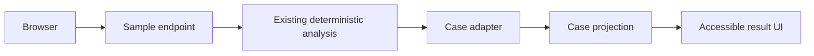
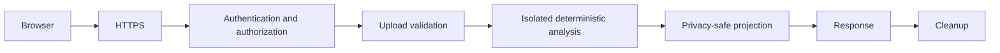
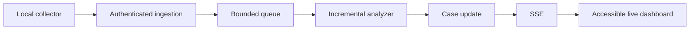

# Web-first Investigation Experience and Secure API Contract

상태: 설계 계약 및 합성 샘플 Phase 1–4 구현 사실<br>
기준일: 2026-10-08<br>
범위: 기존 FastAPI 저장소의 웹 UX와 API 경계. 아래의 현재 구현 사실과 아직 승인만 된 후속 설계를 구분한다.

## 1. 목적

일반 사용자가 터미널이나 로컬 HTML 생성 명령을 몰라도 `사이트 접속 → 샘플 체험 또는 로그 선택 → 분석 실행 → 조사 사례 목록 → 시간순 조사 흐름 → 근거·한계·다음 조사 단계 → HTML 보고서 다운로드`를 완료할 수 있는 제품 구조를 고정한다. 웹은 이미 계산된 결정적 분석을 `IncidentCaseSubjectInput` adapter, `assemble_incident_cases()`, `build_investigation_case_projection()` 순서로 한 번만 통과시킨다. 탐지·상관분석·위험도를 presentation에서 다시 만들지 않는다.

Phase 0의 산출물은 정보 구조, typed JSON 후보, 위협 모델과 release gate였다. Phase 1–4의 합성 샘플 구현 사실은 Section 3에 별도로 기록한다.

## 2. 제품 원칙

- 웹은 일반 사용자의 기본 진입점이다. 사용자가 서버 실행 명령을 알 필요가 없어야 한다.
- CLI는 로컬·민감 환경과 개발자용 선택지이며 제거하지 않는다. HTML report는 저장·공유용 export다.
- 핵심 분석은 LLM 없이 동작한다. AI 설명은 향후에도 명시적으로 선택한 별도 기능이다.
- 탐지는 침해 확정이 아니며 상관관계는 인과관계가 아니다. 로그인 성공도 공격 성공 또는 계정 탈취를 입증하지 않는다.
- 사용하기 어려운 기능은 완료된 기능으로 간주하지 않는다. task completion을 실제 사용자로 검증한다.
- 개인정보 보호가 편의성보다 우선한다. raw logs는 기본적으로 영구 저장하지 않는다.
- 공개 sample과 조직 로그 결과를 명확히 구분한다. sample은 제품 동작 예시이지 보안 점검 인증서가 아니다.
- 실제 로그를 public internet에 받으려면 인증, 격리, 삭제, 제한과 운영 대응이 먼저다. 하나라도 충족하지 못하면 hosted upload는 no-go다.

## 3. 현재 API와 frontend 상태

### 확인된 현재 구현

FastAPI entry point는 `app/api.py`의 module-level `app = create_app()`이다. 기본 app에는 `GET /`, 고정 정적 자산 `GET /assets/style.css`, `GET /assets/app.js`, `GET /api/health`, `POST /api/analyze`, `POST /api/v1/investigations/sample`이 있다. 별도 security config와 audit sink로 factory를 호출할 때만 보호된 `POST /api/analyze-linux-audit`가 추가되며, 이는 일반 웹 업로드 계약이 아니다.

`GET /api/health`는 `{"status":"ok"}`만 반환한다. readiness, dependency health 또는 privacy 보장을 뜻하지 않는다.

현재 `POST /api/analyze`는 `multipart/form-data`의 다음 세 `UploadFile`을 모두 요구한다.

| multipart field | 현재 내부 source | 사용자 표시명 | 필수 |
|---|---|---|---|
| `application_file` | `application` | 애플리케이션 인증 로그 | 예 |
| `ssh_file` | `ssh` | SSH 인증 로그 | 예 |
| `access_file` | `access` | 웹 접근 로그 | 예 |

각 파일은 filename suffix가 `.log` 또는 `.txt`인지, 비어 있지 않은지, 읽은 byte가 10 MiB 이하인지 검사한다. 개별 MIME type과 실제 text/encoding/content는 검증하지 않는다. 세 파일 합계나 multipart envelope의 app-level 제한도 없다. `file.file.read()`로 전체 content를 메모리에 읽은 뒤 `NamedTemporaryFile(delete=False)`에 쓰고, `analyze()`를 정확히 한 번 호출하며 `finally`에서 알려진 path를 삭제한다. 정상·분석 실패 테스트는 삭제를 확인하지만 process crash 뒤 orphan cleanup은 보장하지 않는다. filename은 suffix 선택에만 쓰지만 invalid suffix 오류가 suffix를 되돌려 준다.

현재 response는 Pydantic `AnalysisResponse`이며 top-level은 `analysis_id`, `status`, `summary`, `results`, `global_correlation`, `ai_summary`다. `analysis_id`는 UUID, `ai_summary`는 `None`이다. per-IP result의 detection evidence, correlation과 risk factors 및 raw global correlation을 그대로 가까이 노출하므로 향후 privacy-safe case API로 재사용하지 않는다. 기본 route는 LLM을 호출하지 않지만 인증·인가·rate limit·processing timeout·concurrency limit·custom bounded error envelope가 없다. CORS middleware도 없다.

현재 renderer는 file 없이 `render_investigation_report_html(projection) -> str`로 standalone HTML을 반환할 수 있다. `write_investigation_report_html()`은 CLI용 secure local writer다. 현재 HTML은 기존 subject 중심 `InvestigationReportProjection`을 표시하며 새 조사 사례/typed Timeline은 포함하지 않는다.

`frontend/index.html`, `frontend/style.css`, `frontend/app.js`는 Phase 2의 합성 샘플 Landing/결과 개요다. 고정 GET route만 있고 directory mount, template, SPA catch-all은 없다. 테스트는 `fastapi.testclient.TestClient(app)` 또는 `TestClient(create_app(...))`로 ASGI app을 직접 시작한다. 저장소의 Nginx/systemd 자료는 보호된 Linux Audit endpoint 전용 참조 배포이며 일반 `/api/analyze`를 공개하지 않는다.

### 구현된 Phase 1 sample API와 남은 목표

`POST /api/v1/investigations/sample`은 빈 request만 받는다. query, JSON, form, multipart, file과 non-empty body는 고정 400 envelope로 거부한다. `GET`은 지원하지 않는다. 세 합성 로그는 `app/sample_investigation_api.py`의 immutable allowlist에 source, module-relative filename, SHA-256으로 고정되며 각 4 KiB 이하의 비어 있지 않은 regular file만 허용한다. parent/fixture symlink, 누락, 크기 초과와 digest 변경은 고정 `FIXTURE_UNAVAILABLE`로 fail closed한다. fixture filename/path는 response/error/log에 넣지 않는다. 검증된 byte는 요청마다 private 임시 디렉터리에 복사되며 `analyze()` 한 번과 `project_investigation_cases_from_analysis()` 한 번을 거쳐 명시적 Pydantic response로 변환된다. risk metadata loader의 경로도 module-relative로 고정해 cwd와 무관하다.

Phase 1에서 시작한 response는 Section 9–10의 closed field set에 `sample_context`를 더한다. 실제 값은 `schema_version="1"`, `analysis_summary`, `case_summary`, `cases`, `independent_observations`, `interpretation_notices`, `capabilities`, `bounded_warnings`, `report_export`다. 기본 fixture acceptance count는 대상 10, 지원 탐지 4, 지원 관계 3, 사례 2(HIGH 1/MEDIUM 0/LOW 1), 독립 관찰 3, 관계 포함 사례 2, no-time 0이다. Password Spraying-like와 Path Traversal은 독립 관찰이며 원래 계정 대신 user-facing unavailable 문구만 표시한다. Phase 4 이후 HTML capability는 true이고 실제 로그 업로드, LLM과 Linux Audit capability는 false다.

Sample endpoint는 app instance마다 고정 전역 process-local 12 requests/60 seconds sliding window와 동시 작업 2개 제한을 가진다. client IP/fingerprint는 보관하지 않는다. 10초 응답 deadline이 지나면 bounded 503을 반환하지만 Python worker thread를 종료하지 않는다. 작업이 실제로 끝날 때까지 concurrency slot을 유지하고 완료 시 callback이 예외를 소비하고 slot을 해제한다. 따라서 이 deadline은 hard CPU stop이 아니며 여러 worker/process에 걸친 production rate limit도 아니다. ASGI server/proxy가 이미 받아 메모리에 만든 단일 chunk 크기는 이 handler가 제어하지 못한다. 공개 배포에는 별도 edge body/rate/timeout 통제가 필요하다.

오류 모델은 `error_code`, 고정 한국어 `user_message`, `recovery_action`, `retryable`만 노출한다. body/query 거부, rate/concurrency, timeout, fixture, analysis, case projection, report generation, response invariant 실패를 각각 bounded code로 구분한다. 내부 exception, path, filename, 원래 계정이나 원시 근거를 반환하지 않는다. 실패는 0건 결과로 바꾸지 않는다. 기존 `/api/analyze`와 보호된 Linux Audit route는 변경하지 않는다. 실제 로그 `/api/v1/investigations`는 아직 구현되지 않았고 hosted actual-log upload는 Section 21의 gate 전까지 no-go다.

### 구현된 Phase 2 합성 샘플 웹 화면

기본 app의 `GET /`는 module-relative regular `frontend/index.html`을, `/assets/style.css`와 `/assets/app.js`는 두 고정 파일만 제공한다. 보호된 Linux Audit app factory에는 이 세 정적 route를 등록하지 않는다. 정적 파일은 symlink와 비정규 파일, 빈 파일, 128 KiB 초과 파일을 거부하며 cwd 또는 request path를 사용하지 않는다. 세 route는 OpenAPI에서 제외되어 기존 API schema를 유지한다. 인덱스와 비해시 자산은 `Cache-Control: no-store`이며 `nosniff`, `no-referrer`, 불필요한 브라우저 권한을 비활성화한 `Permissions-Policy`, `frame-ancestors 'none'`을 포함한 HTTP CSP를 사용한다. CSP는 self의 JS/CSS/API만 허용하고 inline/eval/remote source를 허용하지 않는다.

화면은 same-origin static vanilla HTML/CSS/JavaScript만 사용한다. `lang="ko"`, skip link, native button, visible focus, 고정 polite status, 오류 요약 focus, risk text+색상, 의미 순서와 DOM 순서 일치, mobile reflow와 reduced-motion 규칙을 포함한다. 실제 로그 입력 form은 없다. 명시적 클릭에서만 빈 body로 `POST /api/v1/investigations/sample`을 한 번 호출한다. 브라우저는 response byte·문자열·배열 상한과 exact top-level field, schema version, approved risk/category, 사례 수 partition을 검증하고 malformed 응답은 전체 실패로 표시한다. 렌더링은 `createElement`/`textContent`와 고정 class만 사용하고 원래 계정·근거·query·raw log를 화면에 넣지 않는다. 결과는 현재 탭의 DOM/메모리에만 남으며 refresh 시 사라진다. 성공 시 focus를 강제로 옮기지 않고 선택 가능한 결과 이동 링크를 보이며, 실패 시 고정 오류 요약으로 focus를 옮긴다.

Phase 2 완료 시 화면은 합성 샘플 결과, 분석·사례·독립 관찰 요약과 제한된 개요를 표시했다. 아래 Phase 3가 사례 상세와 Timeline을, Phase 4가 대상별 HTML 보고서 다운로드를 추가했다. 실제 로그 웹 업로드, LLM, Linux Audit와 실시간 기능은 제공하지 않는다. `계정 별칭을 표시할 수 없음`은 분석 실패가 아닌 개인정보 경계로 표시한다. hosted actual-log upload는 여전히 no-go다.

### 구현된 Phase 3 사례 상세와 시간순 조사 흐름

기존 sample API response와 경로·schema는 변경하지 않았다. 결과 상단의 합성 샘플·침해 미확정 주의사항은 항상 보이며, 사례 목록은 API review order 그대로 native `<details>/<summary>`를 사용한다. HIGH/MEDIUM은 기본 펼침, LOW는 기본 접힘이다. Summary에는 사례명·대상·위험도 text·주요 탐지·주요 관계·고정 결합 설명을 두고, 펼친 본문에 시간 범위, 수직 `<ol>` Timeline, 탐지 관찰, 지원되는 관계, 기존 위험도 평가, 사례별 한계, 미확인 사항과 최대 3개의 읽기 전용 다음 조사 단계를 순서대로 둔다. 중첩 disclosure와 custom accordion은 없다.

Timeline의 DOM 순서는 API tuple 순서이며 다시 정렬하지 않는다. `OBSERVED_FACT`/`DETECTION_OBSERVATION`/`SUPPORTED_RELATION`은 각각 `관찰된 사실`/`탐지 관찰`/`지원되는 관계` text와 고정 border로 구분한다. 검증된 UTC 문자열만 `<time datetime>`에 넣고 KST를 주요 표시, UTC를 보조 text로 표시한다. 6자리 microseconds와 `시간 정보 없음`을 보존한다. 관계는 기존 상관분석의 지원 관계로만 표시하고 실제 발생 이벤트나 인과관계로 위장하지 않는다.

Public Evidence wire field는 내부 type ID가 아닌 `label/value/unit`이므로 browser는 entry category와 승인된 탐지·관계 표시명에 따라 정확한 allowlist를 검증한다. Brute Force/Password Spraying-like는 `실패 횟수(회)`, `대상 계정 수(개)`, `시간 범위(초)`의 순서·unit·숫자 범위를, 인증 관계는 `시간 차이(초)`를 허용하고 `<dl>`로 표시한다. Path Traversal은 현재 API에 상세 path/evidence가 없어 재구성하지 않고 승인 근거 unavailable 문구만 표시한다. Unknown evidence, category, risk, timestamp, 중복 사례 순서, 비연속 Timeline sequence 또는 3개 초과 next step은 전체 응답 실패로 처리한다. 다음 단계 문구는 기존 fixed read-only allowlist와 정확한 순서를 검증한다.

독립 관찰은 위험도·신뢰도·시각·기존 bounded 이유와 사용 가능한 typed 근거를 표시한다. Password Spraying-like의 typed target membership no-go와 Path Traversal의 인증 사례 미결합 이유를 기존 응답 문구로만 전달한다. 공통 한계는 접힌 사례 밖에 남긴다. 렌더러는 `createElement`/`textContent`와 고정 class만 쓰며 결과 상태는 현재 탭 메모리에만 둔다. Node 내장 VM의 최소 DOM stub 검사는 실제 sample response에 대한 disclosure, 순서, microseconds/no-time 및 malformed nested data의 전체 폐기를 확인하지만 실제 browser layout·keyboard·screen reader acceptance는 아니다. Phase 3에서도 Safari WebDriver는 `Allow remote automation` 비활성화로 세션 생성이 거부되었다. Loopback HTTP에서 HTML/CSS/JS/sample API의 200 응답은 확인했지만 실제 브라우저의 시각·키보드·스크린리더 acceptance는 아직 미검증이다. 다음 단계는 Phase 4 stateless HTML report export다.

### 구현된 Phase 4 stateless HTML 보고서 다운로드

빈 `POST /api/v1/investigations/sample`은 기존 allowlisted synthetic fixture를 검증하고 private 임시 분석 입력으로 `analyze()`를 정확히 한 번 호출한다. 같은 analysis result로 case adapter를 한 번 실행한 뒤 기존 `build_investigation_report_projection()`과 `render_investigation_report_html()`을 각각 한 번 실행한다. CLI secure writer, 별도 report endpoint, 보고서 임시 파일이나 서버 측 결과/HTML 영구 저장은 없다. 분석 입력용 임시 디렉터리는 요청 처리 종료 시 정리한다.

현재 fixture에서 합성 안내가 붙은 renderer의 UTF-8 HTML은 24,966 bytes, 전체 JSON은 39,216 bytes였다. report export 상한은 32 KiB, browser JSON 수신 상한은 64 KiB다. HTML은 standalone HTML5, 기존 CSS와 검증된 CSP style hash, JavaScript·원격 리소스 없음 및 6열 대상별 표를 유지한다. 기존 renderer의 기본 출력은 변경하지 않고 sample 전용 고정 한국어 합성 안내만 opt-in으로 포함한다. 빈·초과·잘못된 renderer output이나 projection/renderer 예외는 고정 `REPORT_GENERATION_FAILED`로 전체 sample transaction을 실패시킨다. 사례 결과만 반환하는 partial success는 없다. 응답 deadline은 여전히 worker thread를 강제로 종료하지 않는다.

`report_export`는 closed Pydantic object로 `available=true`, `format=standalone_html`, `filename=investigation-report.html`, `media_type=text/html;charset=utf-8`, UTF-8 `html`, 실제 인코딩 길이인 `byte_count`, 고정 `format_notice`, 고정 `handling_warning`을 포함한다. Browser는 전체 응답과 export를 검증한 후에만 native `HTML 보고서 다운로드` 버튼을 표시하고, 클릭할 때 export를 재검증해 탭 메모리의 UTF-8 Blob/object URL로 다운로드한다. 생성한 URL과 임시 anchor는 즉시 제거한다. 자동 다운로드, 추가 fetch, DOM HTML 삽입과 browser storage는 없다. 현재 형식은 `대상별 결정적 조사 보고서`이며 조사 사례의 typed Timeline은 포함하지 않는다는 안내와 민감한 파일의 저장·공유·삭제 경고를 버튼 앞에 표시한다. 이 report는 합성 샘플 결과이지 실제 조직의 보안 상태나 인증서가 아니다.

Node 최소 DOM stub은 클릭 전 다운로드 없음, Blob type·크기·고정 파일명, 추가 fetch 없음, URL revoke, malformed export 전체 실패를 검사한다. 이는 실제 browser layout·keyboard·screen reader 검수나 WCAG 합격을 뜻하지 않는다. 실제 로그 업로드·hosted deployment·LLM 설명은 여전히 범위 밖이다.

## 4. 사용자 유형

### 초보 보안 학습자

- 목표: sample로 먼저 탐지·관계·조사 사례를 이해하고 “왜 검토해야 하는지”와 다음 행동을 찾는다.
- 주요 작업: 한 번의 sample 실행, 첫 사례 열기, 시간순 조사 흐름과 용어 도움말 확인.
- 필요한 정보: 위험도 text, 함께 묶인 이유, 관찰과 해석의 차이, 안전한 다음 단계.
- 우려 사항: 탐지를 확정 침해로 오해하거나 sample을 자신의 환경 결과로 오해할 수 있다.
- 실패 복구: 같은 sample 재시도, 오류의 recovery action, 도움말로 이동. 로그 업로드를 요구하지 않는다.
- 첫 화면: 한 문장 설명, 가장 눈에 띄는 `샘플로 체험하기`, sample 배지, “탐지는 침해 확정이 아님”.

### 주니어 보안 분석가

- 목표: 실제 로그에서 우선 조사 사례를 찾고 Timeline·근거·관계를 검토한 뒤 보고서를 내려받는다.
- 주요 작업: 세 필수 로그 선택, validation 수정, 사례/독립 관찰 비교, report export.
- 필요한 정보: 분석 대상, 포함된 최고 위험도, canonical UTC/KST, typed evidence, 지원 관계, 한계와 다음 단계.
- 우려 사항: raw log와 projection 경계, 분석 1회 보장, partial result 의미, 원래 계정 미표시.
- 실패 복구: field에 연결된 오류 수정, retryable 여부 확인, 새 분석 시작. 실패를 0건 결과로 보지 않는다.
- 첫 화면: public에서는 local/private 실행 안내, local에서는 `내 로그 분석하기`와 데이터 처리 요약.

### 개인정보·시스템 관리자

- 목표: 데이터가 어디에 머물고 언제 삭제되며 외부 전송되는지 판단한다.
- 주요 작업: 모드 확인, 업로드·임시 저장·application log·backup·삭제 정책 검토, hosted gate 승인.
- 필요한 정보: bind 범위, encryption, retention, tenant isolation, report 민감도, LLM opt-in field 목록.
- 우려 사항: payload logging, crash orphan, tenant mix-up, 백업 잔존, 자동 외부 AI 전송.
- 실패 복구: 업로드 전 취소, 결과/임시 데이터 삭제 확인, 운영자용 bounded request identifier로 문의.
- 첫 화면: `개인정보 및 데이터 처리` 링크와 현재 모드(`공개 sample`/`로컬 업로드`/`호스팅`)의 명시적 표시.

## 5. 지원 모드

### Public sample demo

로그인 없이 `샘플로 체험하기` 한 번으로 repository에 포함된 non-secret synthetic fixture만 분석한다. 사용자 upload control을 이 모드에 렌더링하지 않고, 결과 전체에 `합성 샘플 결과`를 표시한다. Brute Force, Password Spraying-like, Path Traversal, 지원 관계, 조사 사례와 Timeline을 보여주되 실제 조직의 위험 또는 인증서라고 설명하지 않는다. LLM은 호출하지 않는다. 고정 sample ID allowlist, 작은 concurrency/rate budget, timeout과 응답 caching 가능성을 검토하되 cache에도 사용자 데이터는 없다. sample report는 `교육용 합성 샘플` watermark를 가지며 실제 보안 점검 인증서처럼 보이지 않아야 한다.



### Local/private upload mode

사용자가 직접 실행한 instance는 기본적으로 loopback(`127.0.0.1`과 명시적으로 검증한 local equivalent)에만 bind한다. 세 로그가 모두 필수이며, archive는 받지 않는다. bounded streaming validation 뒤 process-private temporary directory 또는 측정 가능한 memory budget을 사용하고 response 완료·오류·cancellation에 cleanup한다. crash startup scavenging은 별도 검증이 필요하다. HTML report는 response에서 download하고 서버 영구 파일 생성을 요구하지 않는다. 외부 LLM 전송은 기본 비활성화이며, 사용자가 전송 field와 provider 정책을 본 뒤 별도 opt-in하기 전에는 전송하지 않는다.

인증이 없어도 되는 근거는 loopback/local-only 경계뿐이다. `--host 0.0.0.0`, port forwarding, shared host 또는 reverse proxy를 쓰는 순간 local mode 가정은 깨지며 hosted gate를 적용한다.

### Hosted authenticated upload mode

상시 서비스의 실제 로그 upload는 V1에서 구현하지 않는다. authentication, authorization, tenant isolation, HTTPS, same-origin CSRF/CORS 정책, upload/request/rate limit, processing timeout, concurrency control, isolated temporary storage, retention/deletion, sensitive payload 없는 audit logging, secret management, incident response, abuse prevention, dependency/image patching, privacy notice, user-controlled deletion, backup 또는 명시적 no-backup 정책을 모두 배포 전 입증한다. 이 조건이 없으면 public internet에는 sample endpoint만 노출하고 실제 upload는 no-go다.



## 6. 핵심 사용자 흐름

### Landing

한 문장은 “세 종류의 로그에서 결정적 관찰과 관계를 찾아 검토 가능한 조사 사례로 정리합니다.”로 제한한다. primary는 `샘플로 체험하기`, secondary는 `내 로그 분석하기`다. 지원 로그, 개인정보 처리 요약, “탐지는 침해 확정이 아닙니다”, CLI 링크를 첫 viewport 또는 바로 다음 section에 둔다. public sample deployment의 실제 upload는 disabled button으로 가장하지 않는다. secondary는 “실제 로그 업로드는 로컬 실행에서만 제공됩니다”라는 범위 페이지로 이동한다.

### Upload

`fieldset`/`legend` 안에 세 required native file control을 둔다. 표시명은 애플리케이션 인증 로그, SSH 인증 로그, 웹 접근 로그다. 각 control은 `.log/.txt 텍스트`, 비밀정보 포함 가능성, 현재 최대값 또는 `TO_BE_BENCHMARKED`, 선택 상태, `교체`, `제거`, 예시를 설명한다. 현재 일반 API에는 Linux Audit field가 없으므로 “선택적 Linux Audit”으로 표시하지 않는다. 후속 통합 전까지 별도 보호 경계로 설명한다.

filename은 UI 안에서 사용자가 선택을 확인할 때만 local browser text로 보이고 server error·response·telemetry에 echo하지 않는다. drag-and-drop은 보조일 뿐 native 파일 선택 버튼을 항상 둔다.

### Analysis progress

실제 event stream이 없으므로 fake percentage를 금지한다. synchronous 요청 전에는 `파일 확인 중`, 요청 중에는 `로그 분석 중 · 탐지와 관계 및 조사 사례를 구성하고 있습니다`, 완료에는 `결과 준비 완료`, 오류에는 `분석을 완료하지 못했습니다`라는 bounded state만 사용한다. server 내부 단계를 시간에 맞춰 회전시키지 않는다. submit을 pending 동안 중복 실행하지 않되 cancel/keyboard/focus를 막지 않는다. `aria-live`는 state transition만 한 번 알린다.

### Results overview

조사 사례 수, 독립 관찰 수, HIGH/MEDIUM/LOW, 지원되는 관계 포함 사례 수, 분석 대상 수와 해석 주의를 먼저 표시한다. 행동 순서는 `첫 조사 사례 보기`, `독립 관찰 보기`, `HTML 보고서 다운로드`, `새 분석 시작`이다. case projection 성공 전에는 complete success가 아니다.

### Case list

assembler의 review order대로 조사 순서, `조사 사례 N`, 분석 대상 IP, 포함된 최고 위험도, 시간 범위, 관찰 수, 주요 탐지, 주요 지원 관계와 함께 묶인 이유를 표시한다. IP는 공격자 identity가 아니며 NAT/proxy/shared host 가능성을 공통 주의로 보인다.

account reference가 unavailable이면 내부 code 대신 다음 두 문장을 사용한다.

> 계정 별칭을 표시할 수 없음<br>
> 원래 계정 정보는 개인정보 보호를 위해 결과에 포함되지 않습니다.

이는 오류, 서로 다른 계정 또는 분석 실패를 뜻하지 않는다.

### Case detail

정보 순서는 (1) 사례 제목과 포함된 최고 위험도, (2) 함께 묶인 이유, (3) 시간순 조사 흐름, (4) 관찰 근거, (5) 지원되는 관계, (6) 기존 위험도 평가, (7) 해석 시 유의사항, (8) 확인되지 않은 사항, (9) 다음 조사 단계다. 첫 화면에는 위험도·이유·다음 단계를 제공하고 typed evidence, relation detail, canonical UTC, 기술 식별자는 펼친 section에 둔다. “확정 사고가 아님”과 핵심 한계는 접힌 영역에만 숨기지 않는다.

### Independent observations

사례로 안전하게 결합되지 않은 모든 관찰을 표시한다. 각 항목은 표시 유형, subject, 기존 risk/confidence, timestamp/no-time, 승인 근거와 독립 이유를 가진다. Password Spraying-like no-go, Path Traversal, unrelated Brute Force, ambiguous/no-time 관찰을 유실하지 않는다. “독립 관찰은 중요하지 않음·정상·안전을 뜻하지 않습니다”를 section 시작에 표시한다.

### Report export

다운로드 전에 “이 HTML은 민감한 조사 자료일 수 있습니다. 저장 위치와 공유 대상을 확인하세요.”를 표시한다. 브라우저를 자동으로 열지 않는다. 같은 analysis result로 report projection과 HTML을 한 번만 만들고, download content는 browser Blob으로 취급하며 DOM `innerHTML`에 넣지 않는다. raw log, full query, 원래 account, source filename/path는 넣지 않는다.

현재 report는 subject 중심이며 조사 사례/Timeline을 포함하지 않는다는 사실을 download 설명에 표시한다. case report 통합 전에는 `현재 형식: 대상별 결정적 조사 보고서`라고 명명한다.

## 7. 화면 정보 구조

V1 navigation은 `홈`, `분석`, `결과`, `조사 사례`, `독립 관찰`, `개인정보 및 데이터 처리`, `도움말`이다. 관리자·deployment 설정을 일반 화면에 섞지 않는다.

V1 page 후보는 `/`, `/demo`, `/analyze`, `/results`, `/results/cases/{case-number}`, `/results/independent`, `/privacy`, `/help`다. 서버 저장이 없으므로 result ID URL을 만들지 않는다. 결과는 현재 tab memory에만 있고 reload에는 “결과가 브라우저 메모리에 없어 다시 실행해야 합니다”를 보여준다. case number는 report-local ordinal이다.

향후 stateful hosted mode만 `/results/{ephemeral-result-id}`를 사용할 수 있다. locator는 cryptographically random opaque value이고 case/report identity와 분리한다. IP, account, filename, timestamp 또는 이들의 hash fragment를 넣지 않는다. URL과 access log에도 민감정보가 없어야 한다.

## 8. API 전략 비교

| 전략 | 사용자 경험 | 중복 분석 | 개인정보/상태 | 다운로드 | 확장과 위험 |
|---|---|---|---|---|---|
| A. 기존 `/api/analyze`에 case 추가 | 한 요청이나 legacy raw 구조와 새 구조가 섞임 | 없음 | 기존 client와 개인정보 노출을 동시에 유지 | 기존 report와 별도 | response schema breaking risk가 크고 versioning이 불명확 |
| B. 새 versioned synchronous endpoint | 새 UI가 정확한 projection만 받음 | 한 요청·한 분석 | 기본 stateless, browser memory | 같은 response에서 생성한 export payload 사용 가능 | V1에 가장 작고 기존 API 보존. 긴 요청 timeout 한계 |
| C. POST 생성 + GET/report/DELETE | refresh·async·download가 편함 | 없음 | result storage, ownership, expiration, deletion, auth 필요 | 별도 GET 가능 | hosted/실시간 확장에는 좋으나 V1 보안·운영 복잡도가 큼 |

추천은 B다. `POST /api/v1/investigations/sample`은 Phase 1에서 구현된 upload 없는 synthetic sample이다. `POST /api/v1/investigations`는 향후 local/private에서만 세 파일을 받는다. 기존 `/api/analyze`는 그대로 둔다. one request 안에서 deterministic analysis는 한 번, case adapter는 한 번, report projection/render는 필요할 때 같은 result에서 한 번만 실행한다.

V1은 server-side persistent result, result GET endpoint와 raw log 재업로드를 요구하는 report endpoint를 만들지 않는다. report HTML은 같은 response의 bounded export section에 포함하거나, 초기 phase에서 capability를 false로 두었다가 Phase 4에 추가한다. `Accept: text/html`로 같은 upload를 다시 보내 분석을 반복하는 방식은 채택하지 않는다. 향후 C는 authentication·ownership·retention이 승인된 hosted phase에서만 다시 평가한다.

## 9. 추천 V1 API 계약

### Endpoint와 request

- `POST /api/v1/investigations/sample`: 구현됨. body와 user file 없음. allowlisted synthetic fixture를 server가 고정한다. process-local rate/concurrency와 응답 timeout을 둔다.
- `POST /api/v1/investigations`: `multipart/form-data`, exact field `application_file`, `ssh_file`, `access_file`, 모두 하나씩 필수. 최대 file count는 3이며 unknown/repeated field는 reject한다. local/private-only로 시작한다.
- Linux Audit는 이 계약에 포함하지 않는다. 별도 secured boundary를 “optional file”로 위장하지 않는다.

현재 legacy 값은 per-file 10 MiB지만 whole-file memory read 후 검사하므로 새 endpoint의 안전 근거가 아니다. 새 V1의 per-file size, total decoded size, multipart envelope size, line length, field count, processing timeout과 concurrency는 `TO_BE_BENCHMARKED` configuration requirement다. 대표 small/large/malformed fixtures로 peak memory, CPU와 p95 latency를 측정하고 edge와 app limit을 함께 고정하기 전 hosted upload는 no-go다.

request media type은 exact `multipart/form-data` boundary를 요구한다. 개별 part MIME은 client 주장으로 간주하여 allowlist prefilter만 하고 신뢰하지 않는다. extension도 보조 signal이다. chunked byte count, archive signature 거부, NUL/binary rejection, strict UTF-8, non-whitespace, maximum line length와 실제 parser compatibility를 server에서 검증한다. archive는 V1에서 지원하지 않는다. filename은 비신뢰 input이며 path, temp name, response, error, log 또는 report에 쓰지 않는다.

### Response

성공은 `application/json; charset=utf-8`이고 case projection까지 완료된 경우만 2xx다. exact top-level section은 다음과 같다.

```text
InvestigationResponse
├─ schema_version
├─ analysis_summary
├─ case_summary
├─ cases
├─ independent_observations
├─ interpretation_notices
├─ capabilities
├─ bounded_warnings
└─ report_export
```

`schema_version`은 API payload schema version이다. raw analysis dict, assembly, event, Evidence, correlation, global correlation, arbitrary metadata는 반환하지 않는다. `capabilities`는 `html_report_available`, `llm_summary_available`, `linux_audit_aggregate_available`의 bool만 가지며 권한·보안 보장 또는 실행 성공을 뜻하지 않는다. 기본 `llm_summary_available`은 false다.

`report_export`는 Phase 4 이전에 `available=false`와 고정 이유만 두었다. 구현된 Phase 4는 서버가 같은 computed result에서 단 한 번 생성한 escaped standalone HTML text, fixed media type, fixed generic download name과 format notice를 제공한다. source filename은 suggested name에 쓰지 않는다. browser는 text를 Blob download로만 사용한다.

응답에는 raw logs, original accounts, full query, source filename/path, internal error, Linux Audit argv/PROCTITLE/CWD/PATH detail 또는 LLM output을 넣지 않는다.

## 10. Response model

모든 model은 versioned, closed field set과 bounded enum을 사용한다.

```text
InvestigationResponse
  schema_version: "1"
  analysis_summary:
    analyzed_subject_count: integer
    supported_detection_count: integer
    supported_relation_count: integer
  case_summary:
    case_count: integer
    independent_observation_count: integer
    high_case_count: integer
    medium_case_count: integer
    low_case_count: integer
    relation_case_count: integer
    no_time_observation_count: integer
  cases: tuple/list of privacy-safe case projections
  independent_observations: tuple/list of privacy-safe projections
  interpretation_notices: closed-ID localized texts
  capabilities: closed booleans
  bounded_warnings: closed warning code/text pairs
  report_export: unavailable state or bounded HTML download payload
```

`case_count == high_case_count + medium_case_count + low_case_count`다. Case fields는 Phase 2 projection의 report-local `조사 사례 N`, canonical subject, HIGH/MEDIUM/LOW, confidence, UTC/KST, typed Timeline category, approved evidence, fixed limitation/unverified/next-step text를 loss 없이 API model로 옮긴다. internal rule ID가 wire audit에 필요하면 allowlisted machine field로만 두며 display title로 렌더링하지 않는다.

API serialization은 explicit field mapping만 쓴다. `asdict()`, `vars()`, `__dict__`, arbitrary mapping passthrough 또는 recursive generic serializer를 쓰지 않는다. browser는 response string을 text content로 렌더링하고 element ID, class, URL, filename, HTML comment 또는 CSP에 사용하지 않는다.

## 11. Error model

새 endpoint의 모든 실패는 media type과 schema가 같은 bounded envelope다.

```text
InvestigationErrorResponse
  error_code: closed enum
  user_message: fixed Korean text
  recovery_action: fixed Korean text
  field: null | application_file | ssh_file | access_file
  retryable: boolean
  result_state: NOT_CREATED | DISCARDED
```

필요 code는 `REQUIRED_FILE_MISSING`, `EMPTY_FILE`, `UNSUPPORTED_FORMAT`, `UPLOAD_TOO_LARGE`, `MALFORMED_LOG`, `ANALYSIS_TIMEOUT`, `CAPACITY_EXCEEDED`, `DUPLICATE_SUBMISSION`, `CASE_PROJECTION_FAILED`, `REPORT_GENERATION_FAILED`, `SERVICE_UNAVAILABLE`, `AUTHENTICATION_REQUIRED`, `ACCESS_DENIED`, `RESULT_EXPIRED`다. field는 server field allowlist이지 client filename이 아니다.

문구는 무엇을 완료하지 못했는지, 확인할 입력, retry 가능 여부와 결과 생성 여부를 말한다. exception text, traceback, absolute path, filename echo, account, evidence/query/raw line, credential/token, internal class를 포함하지 않는다. unknown error도 request correlation용 비민감 opaque support ID가 승인되기 전에는 내부 identifier를 노출하지 않는다.

V1은 all-or-nothing이다. case projection까지 성공해야 complete success이며 분석 또는 projection 실패를 빈/0 결과로 위장하지 않는다. raw partial analysis를 반환하지 않고 만들어진 partial object를 버린다. 구현된 Phase 4 sample transaction은 report export까지 성공해야 complete success이고 report 생성·검증 실패는 전체 `REPORT_GENERATION_FAILED`다. legacy `/api/analyze` 오류 계약은 변경하지 않는다.

## 12. Upload security

| 위협 | V1 통제/검증 요구 |
|---|---|
| oversized upload·multipart abuse·huge field count | edge+app byte/file/field limit, chunked counting, unknown/repeated part reject, benchmark gate |
| filename traversal·misleading extension/MIME | filename을 storage/path/error에 사용하지 않음, extension/MIME 비신뢰, content 검증 |
| binary payload·archive/decompression bomb | NUL/binary·known archive signature reject, archive 미지원, decompression 없음 |
| extremely long line·slow processing | maximum line length, bounded event count, CPU timeout, cancellation cleanup |
| slow upload | edge read/body timeout와 minimum transfer policy를 deployment에서 검증 |
| duplicate submission | pending button guard + bounded idempotency token 또는 content-independent request state; payload hash를 외부 ID로 노출하지 않음 |
| concurrent resource exhaustion | per-principal/IP edge rate policy, process/distributed concurrency budget, 429 bounded response |
| parser crash·malicious text | isolated bounded worker 검토, strict parser errors, no payload/error logging, fuzz/malformed fixtures |
| prompt-injection-like text | default LLM 없음; log text는 instruction이 아니며 AI opt-in에도 raw text 전송 금지 |
| log forging | source data는 관찰이지 신뢰된 사실이 아님을 UI에 표시; cross-source 관계도 인과로 승격하지 않음 |
| formula/HTML injection | JSON text-context escaping, report renderer escaping+CSP, download를 `innerHTML`로 삽입 금지 |
| symlink/temp-file issue | process-private directory, server-generated name, restrictive permission, no follow/overwrite, exact cleanup target |
| tenant data mix-up | hosted mode authentication+authorization+tenant ownership, per-request isolated storage와 cache key |
| debug traceback·payload application log | production debug off, bounded handler, access/audit log에서 body·filename·query 제외 |
| antivirus expectations | V1 text parser boundary와 no-execution을 명시; AV를 제공한다고 주장하지 않음. hosted risk acceptance 때 별도 결정 |
| retention uncertainty | upload 전에 mode별 정책 표시; 미정 retention이면 hosted no-go |
| external LLM transmission | 기본 off, explicit opt-in, minimized case projection only |
| browser download | fixed `.html` filename, `text/html` Blob download only, no auto-open, 민감 자료 경고 |

OWASP의 defense-in-depth 원칙처럼 extension 하나에 의존하지 않는다. client-side validation은 편의일 뿐 server validation을 대체하지 않는다. FastAPI `UploadFile`의 spooling 동작도 app 전체 request·처리 limit을 보장하지 않으므로 별도 한계가 필요하다.

## 13. 데이터 생명주기

### Public sample

`allowlisted synthetic fixture → deterministic analysis → projection → response`다. user upload와 user payload retention이 없다. abuse/availability 운영 metadata만 bounded policy로 남기며 sample content를 사용자 데이터로 잘못 분류하지 않는다.

### Local upload

`request receive → bounded streaming validation → private memory/temp staging → one analysis → case/report projection → response → cleanup`이다. raw input은 영구 저장하지 않는다. derived result와 HTML은 server DB/file에 저장하지 않고 현재 browser memory에만 둔다. application log에는 payload, filename, subject, account, query 또는 report를 남기지 않는다. backup 대상도 아니다. 정상·오류·cancellation cleanup을 테스트하고 crash cleanup 방법과 잔존 가능성을 UI privacy page에 공개한다.

### Hosted upload

`HTTPS → authentication/authorization → tenant-scoped validation/staging → isolated analysis → minimized response → verified cleanup → user-controlled deletion`이다. raw input, derived result, report, application/audit log, backup 각각의 retention과 deletion SLA를 배포 전에 확정한다. 정해지지 않은 보관 기간을 만들어내지 않는다. payload 없는 operational metadata만 목적·필드·기간을 문서화한다. backup을 하지 않으면 no-backup 정책을, 한다면 tenant deletion과 backup expiry의 차이를 명시한다. crash recovery가 다른 tenant 데이터를 발견하거나 반환해서는 안 된다.

## 14. 개인정보와 LLM 경계

기본 웹 분석은 LLM을 호출하지 않는다. deterministic core, case adapter/projection과 report는 provider key 없이 완성되어야 한다.

향후 `AI 설명 받기`는 별도 unchecked-by-default control이다. 사용자가 provider, 비용/quota 가능성, 데이터 정책과 전송 field를 보기 전에는 활성화하지 않는다. raw log, original account, full query, source path/filename와 Linux Audit private detail은 전송하지 않고 privacy-safe case projection만 최소화해 보낸다. AI 실패에도 core result는 유지하며 AI text는 `AI 설명 · 규칙 기반 결과 아님` section에 시각적·의미적으로 분리한다. AI는 detection, relation, risk, confidence, case order 또는 Timeline을 변경할 수 없다.

IP는 민감한 조사 정보지만 공격자 또는 사람의 identity가 아니다. NAT, proxy, shared system 가능성과 “동일 IP가 동일 사용자를 뜻하지 않음”을 결과에 항상 보인다. account unavailable 문구는 원래 account를 다시 조회·hash·부분노출하지 않는 privacy feature다.

## 15. 접근성 요구사항

접근성은 release gate다. document root는 `lang="ko"`, skip link, semantic `header/nav/main/footer`, 논리 heading hierarchy를 사용한다. 모든 form control은 visible label을 갖고 file group은 `fieldset`/`legend`로 묶는다. required는 text와 native `required`로 표현하며 색상에만 의존하지 않는다. 오류는 해당 field와 programmatically 연결하고 submit 실패 시 error summary heading으로 focus를 옮기되 사용자가 수정한 뒤 자연스럽게 돌아갈 수 있게 한다. focus를 갑자기 잃지 않고 visible focus를 보장한다.

keyboard-only로 전체 흐름을 완료할 수 있어야 한다. drag-and-drop, hover, tooltip 또는 icon-only action을 강요하지 않는다. 위험도에는 HIGH/MEDIUM/LOW text를 병행한다. Timeline DOM order와 시각적 order는 같고, 실제 time sequence를 CSS로 재배열하지 않는다. data table은 visible `caption`, `<th scope="col">`/`scope="row"`를 사용하며 모바일에서는 semantic card 또는 table horizontal overflow fallback을 제공한다.

narrow mobile, 200% zoom과 text spacing에서 화면 전체 horizontal overflow, content loss, focus obscuring이 없어야 한다. 충분한 contrast와 `prefers-reduced-motion`을 지원하고 animation으로 필수 정보를 전달하지 않는다. autoplay, countdown/time limit, hover-only 설명은 없다. native HTML을 우선하며 ARIA는 native semantics로 표현할 수 없는 bounded status에만 쓴다. `aria-live`는 파일 검증·요청 완료 같은 짧은 state transition에 제한하고 raw streaming event를 screen reader에 무제한 전송하지 않는다. 새 결과가 생겨도 사용자가 읽던 위치로 강제 focus/scroll하지 않는다.

WCAG 2.2 AA는 목표 기준이지만 구현·자동 검사·keyboard·screen reader·zoom/contrast의 수동 검증 범위를 모두 기록하기 전 “준수”를 주장하지 않는다. WAI Forms의 visible label, required text, server-side validation, concise recovery notification과 WAI Tables의 caption/header association을 구현 acceptance로 사용한다. APG는 custom widget이 불가피할 때만 참고하고 native control을 우선한다.

## 16. 사용성 요구사항

정량 목표는 다음과 같다.

- 첫 방문 10초 안에 sample 체험을 찾는다.
- 30초 안에 지원 로그와 개인정보 처리 범위를 찾는다.
- 파일 선택 오류를 도움 없이 해결한다.
- 완료 후 10초 안에 첫 조사 사례를 찾는다.
- 30초 안에 사례가 묶인 이유를 자기 말로 설명한다.
- 60초 안에 다음 조사 단계를 찾는다.
- 탐지와 침해 확정, sample과 실제 분석을 혼동하지 않는다.
- account unavailable을 분석 실패나 다른 계정이라는 뜻으로 해석하지 않는다.

화면별 state를 다음처럼 고정한다.

| 화면 | empty | loading | error | success |
|---|---|---|---|---|
| Landing | 해당 없음 | sample 시작 준비 | sample 일시 불가+재시도 | mode와 행동 명확 |
| Upload | 세 파일 미선택 | client validation | field-linked 오류 | 제출 가능 상태 |
| Progress | 요청 전 | indeterminate bounded status | error summary+복구 | 결과 준비 완료 |
| Overview | 지원 규칙 사례 0의 비안전 문구 | response 처리 | result discarded | count invariant 표시 |
| Case list | “지원되는 규칙으로 구성된 조사 사례가 없습니다” | skeleton보다 text status | projection 실패 | ordered cases |
| Independent | “독립 관찰이 없습니다. 안전을 의미하지 않습니다” | 결과와 함께 처리 | 전체 실패 | reason 포함 목록 |
| Report | capability unavailable | 생성 중 text | 저장/생성 복구 | 민감도 경고 후 download |

초보 사용자에게 첫 화면에는 위험도, 조사 사례, 함께 묶인 이유와 다음 조사 단계를 보여준다. typed evidence, relation detail, canonical UTC와 필요한 technical identifier는 progressive disclosure로 제공한다. 단, 확정 사고가 아님·IP/account 한계·독립 관찰 의미는 접힌 section에만 숨기지 않는다.

## 17. 반응형 설계

- narrow mobile: 한 column, summary cards reflow, case를 semantic card로 표시, Timeline은 세로 DOM order다.
- tablet: 2-column summary가 가능하나 content order를 바꾸지 않는다. detail navigation은 문서 흐름 안에 둔다.
- desktop: summary와 case navigation을 넓게 배치할 수 있지만 fixed-width sidebar를 강제하지 않는다.
- 200% zoom: 주요 task가 320 CSS px equivalent에서 reflow하고 page-wide horizontal scroll이 없다. 비교상 table만 labelled scroll region을 허용한다.

긴 IP/UTC/evidence label은 wrap한다. fixed height, clipped text와 hover-only expansion을 금지한다. 위험도 색은 보조이고 text가 source of truth다.

## 18. HTML report 관계

| 후보 | 판단 |
|---|---|
| A. 기존 report 유지+download | V1 초기 선택. 검증된 escaping/CSP를 재사용하지만 조사 사례/Timeline이 없음을 명확히 표시 |
| B. case projection을 기존 report에 추가 | 후속 추천. 한 보고서에서 웹과 의미를 맞추되 projection/privacy/CSP/accessibility regression 필요 |
| C. 새 case report | 당장은 no-go. duplicate renderer·용어·사용자 혼란 위험 |

Phase 4 전에는 기존 report를 `대상별 결정적 조사 보고서`로 그대로 다운로드할 수 있게 설계하고 웹 case result와 동일하다고 주장하지 않는다. Phase 4 후속은 기존 renderer에 privacy-safe case projection section을 추가하는 B를 별도 승인·구현한다. C는 기존 보고서를 폐기하거나 명확한 다른 목적이 입증될 때만 검토한다. web response는 secure CLI writer를 호출하지 않고 renderer의 HTML string을 download payload로 사용한다.

## 19. 기술 선택

| 후보 | 초기 복잡도/유지보수 | 접근성·테스트 | 배포/CSP·dependency | state/report/SSE |
|---|---|---|---|---|
| FastAPI + server templates | 중간; Jinja dependency 필요 | native HTML에 유리 | same-origin이나 template/CSP 검증 필요 | request/response는 단순, browser-memory detail 전환은 script 필요 |
| FastAPI + static vanilla HTML/CSS/JavaScript | 낮음; 현재 구조에 가장 작음 | native control과 DOM 테스트 용이 | same-origin, framework/CDN 없음, strict CSP 용이 | 한 response state와 Blob report에 적합; SSE도 후속 가능 |
| separate React/Vue/Svelte | 높음 | 강한 discipline/toolchain 필요 | 별도 build/deploy와 넓은 dependency surface | 복잡한 state에는 강하지만 V1 과도 |
| HTMX progressive enhancement | 중간 | server HTML은 유리 | 새 dependency/self-host와 CSP 검토 | 부분 update는 좋으나 현재 stateless result ownership이 해결되지 않음 |
| 최소 server-rendered 단일 page | 낮음 | 초기 sample에는 좋음 | 추가 template 없이 문자열 HTML을 만들면 유지보수/escaping 위험 | case detail state가 커지면 빠르게 한계 |

추천 V1은 FastAPI와 같은 origin에서 self-host하는 static vanilla HTML/CSS/JavaScript다. 현재 빈 placeholder를 후속 phase에서 사용하되 이번 단계에서는 수정하지 않는다. framework나 CDN 없이 native form, typed fetch adapter, browser-memory result와 Blob download만 구현한다. client-side state module을 작게 유지하고 text rendering에 `textContent`를 사용한다. 이 선택은 디자인 시스템이 없다는 뜻이 아니라, 작은 semantic token/spacing/risk text 규칙을 repository 내부에 명시한다는 뜻이다.

## 20. 실시간 확장 경계

상시 웹사이트는 사용자의 로컬 로그를 자동으로 읽을 수 없다. 실시간에는 명시적 local collector 또는 기존 log forwarding이 필요하다.



collector identity/authorization, bounded queue와 backpressure, ordering/idempotency, reconnect와 duplicate event 처리를 설계한다. 이벤트마다 LLM을 호출하지 않는다. live UI는 pause/filter/new-count와 connection state text를 제공하고 사용자가 읽는 위치를 강제 이동하지 않는다. `aria-live`에 raw stream을 넣지 않고 bounded “새 관찰 N개” 알림만 쓴다. SSE는 이 단계와 V1에서 구현하지 않는다.

## 21. Deployment gate

Hosted upload는 다음 중 하나라도 참이면 no-go다.

- authentication 또는 per-action authorization 없음
- tenant isolation/ownership test 없음
- end-to-end HTTPS 없음
- upload, multipart, line/event count limit이 benchmark로 검증되지 않음
- processing/upload timeout 또는 cancellation cleanup 없음
- concurrency/rate/abuse control 없음
- temporary file permission·isolation·normal/error/crash cleanup 미검증
- raw log retention, backup, deletion policy가 불명확
- payload/filename/account/query가 application/access/audit log에 기록될 가능성
- user-controlled deletion 또는 expiration ownership 없음
- secret management/rotation과 incident response runbook 없음
- debug mode/traceback 노출
- permissive wildcard CORS 또는 credentialed cross-origin 정책 미검증
- cookie auth를 쓰면서 CSRF 방어 없음
- dependency/image vulnerability와 patch 절차 검토 없음
- blocking accessibility defect 또는 mobile/200% zoom task 실패
- bounded error에 internal detail 노출
- user data가 명시적 선택 없이 LLM에 전송됨

capability flag, TLS termination 또는 authentication 하나만으로 전체 hosted 안전을 주장하지 않는다.

## 22. 단계별 구현 계획

| 단계 | deliverable | automated/privacy tests | accessibility/usability validation | security stop condition |
|---|---|---|---|---|
| Phase 0 — web/API contract | 이 문서와 doc contract | 문서 scope·privacy tokens | wireframe/task walkthrough | 현재/미래 경계가 섞이면 중단 |
| Phase 1 — public sample API | versioned sample endpoint, one analysis | exact response, adapter once, no upload/LLM, canary | response labels review | synthetic allowlist·rate/timeout 없으면 중단 |
| Phase 2 — accessible sample web UI | Landing/demo/overview | DOM, keyboard hooks, no unsafe HTML | keyboard, screen reader smoke, 200% zoom, 10초 sample task | upload control 노출 또는 blocker면 중단 |
| Phase 3 — case detail and Timeline UI | case list/detail/independent | category/order/time/privacy | reading order, focus, 30/60초 tasks | semantic reorder·확정 침해 표현이면 중단 |
| Phase 4 — stateless HTML report download | same-result single render | renderer once, CSP/escape/canary, no server file | labelled download and warning | raw reupload·auto-open·unescaped content면 중단 |
| Phase 5 — local/private upload UI | loopback three-file workflow | upload limits, malformed/cancel cleanup, no LLM | form labels, error focus, self-recovery | non-loopback exposure·unbenchmarked limits면 중단 |
| Phase 6 — authenticated hosted upload | tenant-owned bounded processing | authz, tenant mix-up, CSRF/CORS, deletion | privacy comprehension | deployment gate 하나라도 실패하면 중단 |
| Phase 7 — deployment hardening | TLS/proxy/limits/monitoring/runbooks | staging abuse/failure/restore tests | production-like accessibility regression | secrets/debug/payload logging/retention 불명확 시 중단 |
| Phase 8 — optional real-time collector and SSE | authenticated collector/live update | order, duplicate, reconnect, backpressure | pause/filter/new-count and AT load | local auto-read 주장·per-event LLM·focus disruption이면 중단 |

## 23. 사용성 테스트 계획

먼저 초보 보안 학습자 3–5명, 주니어 보안 분석가 3–5명, 개인정보·시스템 관리자 2–3명으로 formative test를 한다. 작은 표본은 문제 발견용이며 통계적 일반화를 주장하지 않는다. synthetic data만 사용하고 참가자에게 실제 credential/log를 요구하지 않는다.

Task는 (1) sample 시작, (2) 지원 파일·데이터 처리 찾기, (3) 의도적으로 잘못 선택한 파일 복구, (4) 첫 사례와 묶인 이유 설명, (5) 독립 관찰 의미 설명, (6) 다음 단계 찾기, (7) report 민감도와 account unavailable 의미 설명이다. 측정값은 task completion rate, time on task, first-click success, 오류 자가 복구율, 도움 요청 횟수, 잘못된 보안 결론 수, sample/real confusion, account-unavailable interpretation, 다음 단계 선택 정확도와 perceived workload다.

자동 검사는 axe류 도구를 향후 dependency 결정 뒤 CI에 넣되 그것만으로 준수를 주장하지 않는다. 수동 검사는 keyboard-only, visible focus/focus order, VoiceOver 또는 NVDA의 대표 조합, 200% zoom, narrow mobile reflow, contrast, reduced motion, high contrast와 download flow를 기록한다. 실패 기준은 핵심 task 미완료, 탐지=침해 오해, 개인정보 범위 미발견, keyboard trap, field error 미연결 또는 Timeline reading order 불일치다.

## 24. 알려진 한계

- 현재 legacy `/api/analyze`는 privacy-safe case API가 아니며 인증 없는 실제 upload를 public internet에 노출할 수 없다. 별도 sample-only privacy-safe case API와 합성 샘플 웹 사례·Timeline 화면은 구현되었다.
- 현재 file validation은 suffix/size 중심이고 whole-file memory read, total limit 부재와 crash orphan 위험이 있다.
- 현재 HTML report에는 조사 사례와 Timeline이 없다.
- account alias는 Phase 1 assembly가 safe reference를 보존하지 않아 unavailable이다. 원본을 복원하지 않는다.
- synchronous V1은 긴 분석, refresh와 multi-device resume에 한계가 있다.
- browser-memory 결과는 reload/tab close 때 사라진다. 이는 storage 회피의 의도된 tradeoff다.
- antivirus, archive, real-time collection, tenant storage, hosted deletion과 optional AI는 아직 제공하지 않는다.
- usability와 WCAG 목표는 아직 실제 사용자·browser·assistive technology로 검증되지 않았다.

## 25. Go/no-go 기준

### Web/sample go

- sample endpoint가 user upload와 LLM 없이 synthetic allowlist만 분석한다.
- existing `/api/analyze`와 모든 production contract가 그대로다.
- one analysis/one adapter invocation과 deterministic projection이 테스트된다.
- raw log, original account, full query, path/filename, private Linux Audit detail와 internal exception privacy canary가 response/DOM/error/report에 0건이다.
- keyboard core flow, focus, colour-independent risk, Timeline DOM order, mobile/200% zoom과 bounded errors가 통과한다.
- 사용성 목표의 formative test에서 blocking 오해와 task failure가 해소된다.

### Local upload go

위 항목에 더해 loopback bind, exact three-file contract, benchmarked limits, content validation, normal/error/cancellation cleanup, no payload logging과 no automatic LLM을 입증한다.

### Hosted upload no-go

Section 21의 deployment gate 하나라도 증거가 없으면 no-go다. 빈 capability, 문서 약속 또는 개발 환경 테스트를 production 증거로 대체하지 않는다.

## 26. 참고 자료

공식 자료는 2026-10-08에 확인했다.

- W3C, [Web Content Accessibility Guidelines (WCAG) 2.2](https://www.w3.org/TR/WCAG22/): reflow, keyboard/focus, errors, status messages, language와 contrast의 normative 기준.
- W3C WAI, [Forms Tutorial](https://www.w3.org/WAI/tutorials/forms/): visible labels, instructions, validation과 user notification.
- W3C WAI, [Tables Tutorial](https://www.w3.org/WAI/tutorials/tables/): caption, header cell과 `scope` 관계.
- W3C WAI, [ARIA Authoring Practices Guide](https://www.w3.org/WAI/ARIA/apg/): custom pattern의 semantics와 keyboard guidance. WCAG와 달리 informative guidance임을 구분한다.
- OWASP, [File Upload Cheat Sheet](https://cheatsheetseries.owasp.org/cheatsheets/File_Upload_Cheat_Sheet.html): extension/content type만 신뢰하지 않는 defense in depth, size·storage·authorization·serving controls.
- OWASP, [Input Validation Cheat Sheet](https://cheatsheetseries.owasp.org/cheatsheets/Input_Validation_Cheat_Sheet.html): server-side syntactic/semantic validation과 bounded allowlist.
- FastAPI, [Request Files](https://fastapi.tiangolo.com/tutorial/request-files/): multipart `File`/`UploadFile` 계약과 whole-byte input의 memory 특성.

### Wireframes

다음 wireframe은 시각 장식이 아니라 DOM/정보 우선순위 계약이다. 각 화면은 고유 heading, primary/secondary action, status, error와 accessibility note를 가진다.

#### Landing

```text
[Skip to main]
Header: AI Security Log Analyzer | 개인정보 | 도움말 | CLI
Main h1: 로그를 조사 사례와 시간순 흐름으로 이해하세요
Notice: 탐지는 침해 확정이 아닙니다.
[Primary: 샘플로 체험하기] [Secondary: 내 로그 분석하기]
Status: 현재 모드 — 공개 합성 샘플
Error region: 샘플 서비스를 시작할 수 없음 + 재시도
Supported logs / data-handling summary
A11y: actions are native links/buttons; sample label is text, not colour only
```

#### Upload

```text
h1: 내 로그 분석하기
Privacy notice + local-only mode
fieldset legend: 필수 로그 3개
  label: 애플리케이션 인증 로그 (필수) [Choose file] [교체/제거]
  label: SSH 인증 로그 (필수) [Choose file] [교체/제거]
  label: 웹 접근 로그 (필수) [Choose file] [교체/제거]
Status: 2/3 files selected
Error summary -> linked field error and recovery
[Primary: 분석 실행] [Secondary: 취소/홈]
A11y: visible labels, required text, keyboard file control, fieldset/legend
```

#### Progress

```text
h1: 분석 중
Status: 로그 분석 중 · 조사 사례를 구성하고 있습니다
[Indeterminate progress; no fake percentage]
[Primary: wait/no action] [Secondary: 안전하게 취소, when supported]
Error: 분석을 완료하지 못함 + retryable + result NOT_CREATED
A11y: bounded aria-live state changes; focus stays with the user
```

#### Results overview

```text
h1: 분석 결과
Status: 결과 준비 완료 | sample/local badge
Cards: 조사 사례 | 독립 관찰 | HIGH/MEDIUM/LOW | 관계 포함 | 대상
Persistent notice: 탐지·관계는 확정 침해·인과가 아님
[Primary: 첫 조사 사례 보기] [Secondary: 독립 관찰 보기]
[HTML 보고서 다운로드] [새 분석 시작]
Error/empty: 사례 0은 안전을 의미하지 않음
A11y: heading/card reading order, text risk, no auto-focus to new result
```

#### Case list

```text
h1: 조사 사례
Status: review order로 N개
Article: 조사 사례 1 | subject | HIGH | time range
  주요 탐지 / 주요 지원 관계 / 함께 묶인 이유 / 관찰 수
  계정 별칭을 표시할 수 없음 + privacy explanation
  [Primary: 사례 자세히 보기]
[Secondary: 결과 요약]
Error/empty: 지원되는 규칙으로 구성된 사례 없음; 안전 의미 아님
A11y: semantic articles or captioned table; DOM order equals review order
```

#### Case detail

```text
h1: 조사 사례 1 — 포함된 최고 위험도 HIGH
Reason + persistent interpretation notice
h2: 시간순 조사 흐름 (vertical DOM order)
h2: 관찰 근거
h2: 지원되는 관계
h2: 위험도 평가
h2: 해석 시 유의사항 / 확인되지 않은 사항
h2: 다음 조사 단계 (maximum 3)
[Primary: 다음 사례] [Secondary: 사례 목록]
Status: timestamps in KST and UTC; explicit no-time group
Error: detail unavailable, no partial raw object
A11y: category text, logical headings, details disclosure optional for technical data
```

#### Independent observations

```text
h1: 독립 관찰
Notice: 독립은 중요하지 않음·정상·안전을 뜻하지 않습니다
Items: type | subject | risk/confidence | time | evidence | bounded reason
[Primary: 관찰 검토] [Secondary: 결과 요약]
Status: Password Spraying-like membership no-go shown in plain language
Error/empty: 독립 관찰 없음; 안전 의미 아님
A11y: list/article semantics and text reasons, not badge colour alone
```

#### Error state

```text
[focus target] h1: 분석을 완료하지 못했습니다
Error code-independent user message
What failed | what to check | retryable | result was not created
[Primary: 입력 확인] [Secondary: 홈/도움말]
Status: NOT_CREATED or DISCARDED
No filename, payload, traceback, account, path or internal class
A11y: summary receives focus after submit; each field error is associated
```

#### Privacy/data handling page

```text
h1: 개인정보 및 데이터 처리
Current mode badge in text
Sections: raw input | derived result | report | app logs | backup | retention | deletion
LLM default off and future opt-in boundary
[Primary: 모드에 맞는 분석 시작] [Secondary: 도움말/CLI]
Status: hosted upload unavailable until gates pass
Error: policy unavailable => actual upload no-go
A11y: headings and plain-language definitions; no essential tooltip
```

#### Report export confirmation

```text
h1: HTML 보고서 다운로드
Warning: 민감한 조사 자료; 저장·공유 대상 확인
Format notice: 현재 대상별 보고서, case Timeline 미포함
[Primary: 다운로드] [Secondary: 결과로 돌아가기]
Status: available/unavailable capability with reason
Error: generation failed; whether projection remains valid
A11y: no auto-open, descriptive filename text, native button and status
```
